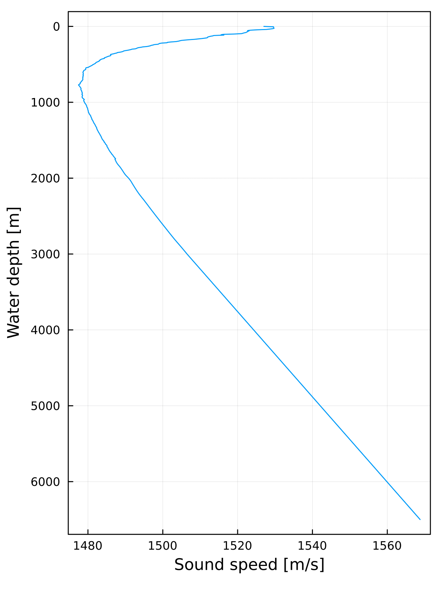
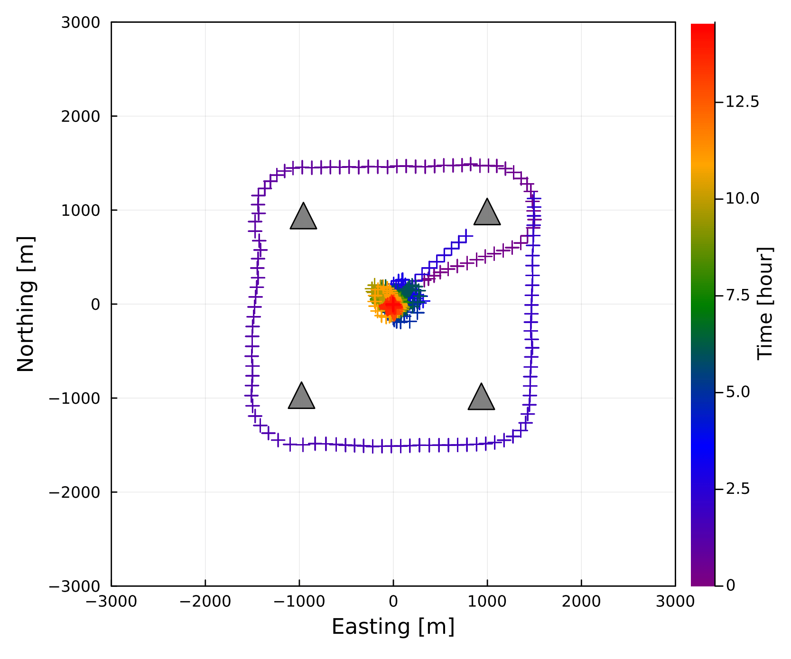
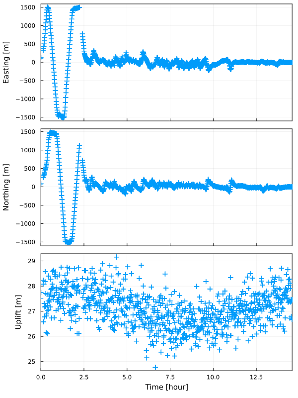

```@meta
CurrentModule = SeaGap
```

# Dataformat

Documentation for the input dataformat in [SeaGap](https://github.com/f-tommy/SeaGap.jl).

In SeaGap, the following input data files are basically required:

* [tr-ant.inp](#tr-ant.inp): Position of a transducer attached to a sea-surface platform relative to the GNSS antenna position
* [pxp-ini.xyh](#pxp-ini.xyh): Position of seafloor transponders at each site
* [ss\_prof.zv](#ss_prof.zv): Underwater sound speed profile
* [obsdata.inp](#obsdata.inp): Basic observational data, which are GNSS antenna positions when transmitting and recieving acoustic signals, sea-surface platform attitude, travel-times

The above file names are given as default values, and they can be optionally changed.
These files are text data format with delimitation of space.

## tr-ant.inp

Three components of position of a transducer attached to a sea-surface platform relative to the GNSS antenna position are shown in this file.
Using these values, the GNSS antenna positions (written in [obsdata.inp](#obsdata.inp)) are converted into the transducer positions with the right-handed system. Note that this definision is different from [GARPOS](https://github.com/s-watanabe-jhod/garpos).

The file is an one-lined file with three rows for example:

$ cat tr-ant.inp
```
0.188984299 -6.990937724 -15.300000000
``` 

Each row is given as (1: X, 2: Y, 3: Z).

## pxp-ini.xyh

Positions of individual seafloor transponders at each site are given in the file. The positions must be given in meter. In order to provide these positions, you have to convert geographic coordinates into the projection coordinates. The projection center should be defined as a center of the transponder array for each site, and must be fixed among GNSS-A campaign cruises. You can convert the geographic coordinates into the projection coordinates by ll2xy function shown in Others via [GMT](https://github.com/GenericMappingTools/GMT.jl)'s mapprojection module

The file has three rows, which indicate the transponder positions in meter (1: EW position, 2: NS position, 3: UD position).
Each line shows one seafloor transponder position; thus, the total number of lines indicate the total number of transponders at each site.
The line number of this file corresponds to the transponder number written in [obsdata.inp](#obsdata.inp).

$ cat pxp-ini.xyh
```
 997.5346  985.5925 -2738.9998
-956.8931  941.9216 -2683.2858
-977.3029 -968.6586 -2689.2996
 935.8767 -980.5919 -2710.8535
``` 

## ss\_prof.zv

Underwater sound speed profile is given in this file. In order to precise calculation of travel-times, you should prepare a profile with 5-m or less interval. The rows of this file indicate (1: water depth [m], 2: sound speed [m/sec]), respectively.

$ head ss\_prof.zv
```
 0.00 1526.998
 5.00 1529.598
10.00 1529.594
15.00 1529.637
20.00 1529.684
25.00 1529.748
30.00 1529.343
35.00 1528.586
40.00 1527.722
45.00 1525.194
```  

Maximum depth of ss\_prof.zv must be deeper than maximum depth of the seafloor transponders wriiten in "pxp-ini.xyh". Thus, you should prepare a long profile deeper than the water depth by extrapolation.

You can optionally draw figure of the sound speed profile by `plot_prof(;fno,fn)` function. `fn` is the file name of a sound speed profile (the default is `fn="ss_prof.zv"`). `fno` is the output file name (the default is `fno="ss_prof.pdf"`). If you change the filename extension, the output file format is automatically changed (e.g., ".png",".svg"). If you use this function with `show=true` keyword argument in REPL, you can display as GUI (but not saved as a figure file). 

```julia
SeaGap.plot_prof(fno="ss_prof.png",fn="ss_prof.zv",show=false) 
```  

```@raw html

```

## obsdata.inp

Basic observational data (GNSS antenna positions when transmitting and recieving acoustic signals, sea-surface platform attitude, travel-times) are given in this file. The file format is similar with the observational file format for [GARPOS](https://github.com/s-watanabe-jhod/garpos).

Each line of "obsdata.inp" shows a record of single acoustic signal which is transmitted from a sea-surface platform to a seafloor transponder and is then replied from the transponder to the sea-surface platform.

The rows of "obsdata.inp" indicate as following:
(1: Seafloor transponder number, 2: Two-way travel time [sec], 3: Transmitted time [sec], 4-6: Sea-surface platform positions (EW, NS, UD) when transmitting [m], 7-9: Sea-surface platform attitude (heading, pitch, roll) when transmitting [deg], 10: Recieved time [sec], 11-13: Sea-surface platform positions (EW, NS, UD) when recieving [m], 14-16: Sea-surface platform attitude (heading, pitch, roll) when recieving [deg], 17: Flag).

The seafloor transponder number is linked to the line number of [pxp-ini.xyh](#pxp-ini.xyh). The two-ways travel-time is "pure" travel-time" without any mechanical delays of a transponder. 
The transmitted and recieved times are cumulative seconds from the reference time. The reference time can be optionally defined by User. The sea-surface platform positions indicate positions of the GNSS anttena attached to the sea-surface platform. The positions are given in a projected coordinate frame. The attitude of the sea-surface platform is expressed in the right-handed system. The flag is only used for kinematic GNSS-Acoustic positioning, and it indicates a kind of group number for multiple acoustic pings shotted during a short period.

$ head obsdata.inp (Example)
```
1 4.092873 500664407.000000 107.052906 74.548265 27.509100 -44.27880 -0.45120 0.53640 500664413.190025 110.958430 76.322974 28.357222 -44.93029 -2.03165 0.89020 1
2 4.058711 500664407.000000 107.052906 74.548265 27.509100 -44.27880 -0.45120 0.53640 500664413.155863 110.937832 76.317022 28.336117 -44.92675 -2.00787 0.88108 1
3 4.160390 500664407.000000 107.052906 74.548265 27.509100 -44.27880 -0.45120 0.53640 500664413.257542 110.998491 76.334356 28.398036 -44.93772 -2.07649 0.90733 1
4 4.092871 500664407.000000 107.052906 74.548265 27.509100 -44.27880 -0.45120 0.53640 500664413.190022 110.958429 76.322973 28.357220 -44.93029 -2.03165 0.89020 1
1 4.062968 500664437.000000 124.731386 83.455137 27.747350 -49.09920 -0.61400 1.18480 500664443.160120 127.715931 85.928776 27.160121 -50.11292 -0.23815 -1.57863 2
2 4.066063 500664437.000000 124.731386 83.455137 27.747350 -49.09920 -0.61400 1.18480 500664443.163215 127.718777 85.930559 27.160110 -50.11357 -0.23972 -1.57478 2
3 4.171606 500664437.000000 124.731386 83.455137 27.747350 -49.09920 -0.61400 1.18480 500664443.268758 127.816621 85.991144 27.160509 -50.13403 -0.29212 -1.43669 2
4 4.090700 500664437.000000 124.731386 83.455137 27.747350 -49.09920 -0.61400 1.18480 500664443.187852 127.741480 85.944743 27.160067 -50.11868 -0.25212 -1.54370 2
1 3.932951 500664917.000000 328.924820 253.690718 28.230250 -52.76000 -1.08760 -4.84800 500664923.030102 332.595337 256.316298 27.751791 -52.68875 -0.89626 1.21533 3
2 4.113385 500664917.000000 328.924820 253.690718 28.230250 -52.76000 -1.08760 -4.84800 500664923.210538 332.613304 256.277211 27.956816 -52.70038 -1.13750 0.54747 3
```

You can easily make figure showing a track of the sea-surface platform by `plot_track(xrange,yrange;autoscale,fn1,fn2,fno)`. `fn1` and `fn2` correspond to the file names of [pxp-ini.xyh](#pxp-ini.xyh) and [obsdata.inp](#obsdata.inp), respectively. `fno` is the output figure name. If you set `autoscale=true`, the plot range is automatically defined depending on the data. If you set `autoscale=false`, the plota range is defined as `xrange` and `yrange` as following:

```julia
SeaGap.plot_track((-3000,3000),(-3000,3000),autoscale=false,fn1="pxp-ini.xyh",fn2="obsdata.inp",fno="track.pdf")
```

```@raw html

```

This figure shows track of the sea-surface platform with the colors indicating the observational time [hours] from the begining of the observation.  
Note that you can omit the file names if you use the default file names.

Moreover, you can also make figure on time-series of the sea-surface platform positions by `plot_timetrack(xrange,yrange,zrange; autoscale,fn,fno)`. `fn` corresponds to the file name of [obsdata.inp](#obsdata.inp), and `zrange` is used for the plot range in the uplift component when you set `autoscale=false`.

```julia
SeaGap.plot_timetrack(fno="timetrack.png")
```

```@raw html

```

### Make obsdata.inp using SeaGap module

To prepare [obsdata.inp](#obsdata.inp), you need to obtain the GNSS antenna positions and the attitudes when transmitted and recieved. SeaGap prepares an interpolation module `interpolate_gps()` to obtain these from GNSS antenna and attitude time-series by cubic Spline interpolation via [Dierckx](https://github.com/kbarbary/Dierckx.jl). Moreover, `obsdata_format(numk; fno,fn1,fn21,fn22)` provides [obsdata.inp](#obsdata.inp) using following files:

* [gps.jxyhhpr](#gps.jxyhhpr): Time-series of GNSS antenna positions and attitudes for a sea-surface platform
* [pxp-_k_.jttq](#pxp-_k_.jttq): Travel-time data for _k_ th seafloor transponder

`numk` is the total number of seafloor transponders at the corresponding site. `fno` is the output file name (the default is `fno="obsdata.inp"`), and `fn1` is the input file denoting time-series of GNSS antenna positions and attitudes (the default is `fn1="gps.jxyhhpr"`). `fn21` and `fn22` compose the input file denoting travel-time data (the defaults are `fn21="pxp-"` and `fn22=".jttq"`).

```julia
obsdata_format(4, fno="obsdata.inp",fn1="gps.jxyhhpr",fn21="pxp-",fn22=".jttq")
```

The flag of "obsdata.inp" is automatically given; the same group number is given when an acoustic signal is simultaneously transmitted to multiple transponders.


#### gps.jxyhhpr
"gps.jxyhhpr" is composed of (1: Cumulative time [sec], 2-4: GNSS antenna position (EW, NS, UD) [m], 5-7: Sea-surface platform attitudes (heading, pitch, roll) [deg]).

$ head gps.jxyhhpr
```
500663320.00 -435.572296 2767.288008 27.875250 -4.5784 -1.4752 0.2540
500663320.50 -435.212859 2764.964937 27.644200 -4.4348 -1.0296 -0.5176
500663321.00 -434.903256 2762.702454 27.533200 -4.2144 -0.8856 -1.0988
500663321.50 -434.616991 2760.506550 27.577200 -3.9376 -1.0300 -1.4052
500663322.00 -434.303558 2758.349148 27.688650 -3.6868 -1.2688 -1.4408
500663322.50 -433.920186 2756.175543 27.709300 -3.5284 -1.3532 -1.2196
500663323.00 -433.436063 2753.973914 27.534550 -3.4464 -1.1888 -0.7060
500663323.50 -432.877593 2751.762461 27.240900 -3.3472 -0.8852 0.0952
500663324.00 -432.288898 2749.563935 26.938300 -3.1948 -0.6000 1.0656
500663324.50 -431.709422 2747.367239 26.737900 -3.0584 -0.3556 1.9636
```

A gyro generally obtains the heading in the range of (-180:180) or (0:360) degree. In the case of (0:360), when the heading increases over 360 deg, the heading of 361 deg is recorded as 1 deg. This uncontinuous gap possibly affect the interpolation; thus, it is plausible to transform the heading as continuous values.

If you'd like to obtain the cumulative seconds from date-and-time, you can use `date2sec()` or `date2sec_txt()` functions to perform the transformation.

Moreover, if you'd like to obtain the projected XY positions from geographic coordinates, you can use `ll2xy()`, `ll2xy_vec()` or `ll2xy_txt()` functions to perform the transformation.

The details of these functions are shown in the Others tab.

If you have the following file:

$ head gps.tllhhpr
```
2015-11-13T05:08:40.0 142.077767915 36.182468927 27.875250 -4.5784 -1.4752 0.2540
2015-11-13T05:08:40.5 142.077771912 36.182447992 27.644200 -4.4348 -1.0296 -0.5176
2015-11-13T05:08:41.0 142.077775355 36.182427602 27.533200 -4.2144 -0.8856 -1.0988
2015-11-13T05:08:41.5 142.077778539 36.182407813 27.577200 -3.9376 -1.0300 -1.4052
2015-11-13T05:08:42.0 142.077782024 36.182388370 27.688650 -3.6868 -1.2688 -1.4408
2015-11-13T05:08:42.5 142.077786287 36.182368782 27.709300 -3.5284 -1.3532 -1.2196
2015-11-13T05:08:43.0 142.077791670 36.182348941 27.534550 -3.4464 -1.1888 -0.7060
2015-11-13T05:08:43.5 142.077797880 36.182329011 27.240900 -3.3472 -0.8852 0.0952
2015-11-13T05:08:44.0 142.077804425 36.182309198 26.938300 -3.1948 -0.6000 1.0656
2015-11-13T05:08:44.5 142.077810868 36.182289402 26.737900 -3.0584 -0.3556 1.9636
```

you can transform it into the above "gps.jxyhhpr" as following:
```julia
SeaGap.date2sec_txt("gps.tllhhpr","gps.jllhhpr")
SeaGap.ll2xy_txt("gps.jllhhpr","gps.jxyhhpr",2,142.082610,36.157530)
```


#### pxp-_k_.jttq

"pxp-_k_.jttq" is a travel-time file for _k_ th seafloor transponder, and is composed of (1: Cumulative time when transmitting [sec], 2: two-ways travel-time with delay [sec], 3: "pure" two-ways travel-time without delay, 4: quality).

The delay indicates a mechanical delay of the transponder system. Thus, summation of the 1st and 2nd culumns corresponds to the time when the acoustic signal is recieved at the sea-surface transducer. The quality is for a kind of quality values such as a correlation cofficient for acoustic signal detection; but, this valueis  not used in the programs of SeaGap. If you do not have any quality value, you should fill the column by somewhat numerical value such as "0".  

$ head pxp-1.jttq
```
500664407 6.190025 4.092873 0.358
500664437 6.160120 4.062968 0.296
500664917 6.030102 3.932951 0.449
500664977 6.012870 3.915718 0.484
500665037 5.989008 3.891855 0.443
500665097 5.961280 3.864128 0.574
500665157 5.931393 3.834240 0.508
500665217 5.905003 3.807850 0.434
500665277 5.882903 3.785751 0.538
500665337 5.865007 3.767856 0.564
```

You have to individually prepare this type of files for all seafloor transponders ("pxp-1.jttq", "pxp-2.jttq", ...).


