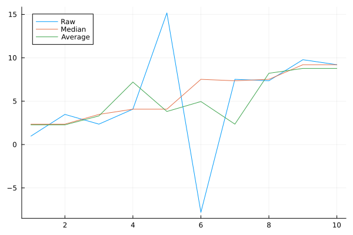
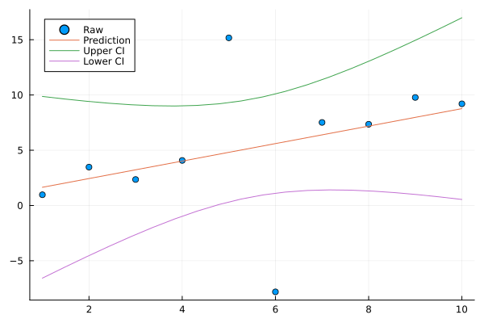

```@meta
CurrentModule = SeaGap
```

# Others

Documentation for the other usable functions equipped in [SeaGap](https://github.com/f-tommy/SeaGap.jl).

* [Date & Time processing](#Date & Time processing)
* [Coordinate transformation](#Coordinate transformation)
* [Sorting](#Sorting)
* [Running filter](#Running\ filter)
* [Simple inversion](#Simple\ inversion)
* [Line fit](#Line\ fit)


## Date & Time processing

### date -> cal

`date2cal()` transforms "date" into "cumulative days in year".

```julia
year, cal = SeaGap.date2cal("2015-10-01")
(2015, 274)
```

If you use this function as `date2cal.()`, you can handle a vector input and transform multiple values.

Moreover, `date2cal_txt(fn0,fn)` reads a text file (`fn0` is the input file name) with dates in the first row and writes a text file (`fn` is the output file name) after transformation.

If preparing the following text file:

$ cat test01.txt
```
2015-10-10T12:00:00 100
2015-12-10T12:00:00 200
2016-02-10T12:00:00 300
```

and performing the following:
```julia
SeaGap.date2cal_txt("test01.txt","test1.txt")
```

you can obtain the following output file:

$ cat test1.txt
```
2015 283 100
2015 344 200
2016 041 300
```

### date -> year 

`date2year()` transforms "date" into "year".

```julia
year, cal = SeaGap.date2year("2015-10-01")
2015.7506849315068
```

If you use this function as `date2year.()`, you can handle a vector input and transform multiple values.

Moreover, `date2year_txt(fn0,fn)` reads a text file (`fn0` is the input file name) with dates in the first row and writes a text file (`fn` is the output file name) after transformation.

If preparing the above text file (test01.txt) and performing the following:
```julia
SeaGap.date2year_txt("test01.txt","test1.txt")
```

you can obtain the following output file:

$ cat test1.txt
```
2015.775342465754 100
2015.942465753425 200
2016.112021857924 300
```

### date -> sec

`date2sec(t,t0)` transforms "date" into "cumulative seconds from the reference date".
The reference date `t0` is set to 2000-01-01T12:00:00 as the defalt value.

```julia
sec = SeaGap.date2sec("2015-10-01T12:34:56")
4.96974896e8
sec = SeaGap.date2sec("2015-10-01T12:34:56",t0="2015-01-01T12:00:00")
2.3589296e7
```

If you use this function as `date2sec.()`, you can handle a vector input and transform multiple values.

Moreover, `date2sec_txt(fn0,fn,t0)` reads a text file (`fn0` is the input file name) with dates in the first row and writes a text file (`fn` is the output file name) after transformation.

If preparing the above text file (test01.txt) and performing the following:
```julia
SeaGap.date2sec_txt("test01.txt","test1.txt")
```

you can obtain the following output file:
$ cat test1.txt
```
497750400.000000 100
503020800.000000 200
508377600.000000 300
```

### sec -> date

`sec2date(t,t0)` and `sec2date_txt(fn0,fn,t0)` work as reverse functions of `date2sec(t,t0)` and `date2sec_txt(fn0,fn,t0)`, respectively.

### sec -> year

`sec2year(t,t0)` and `sec2year_txt(fn0,fn,t0)` convert "cumulative seconds from the reference date" into "year".
The reference date `t0` is set to 2000-01-01T12:00:00 as the defalt value.

```julia
SeaGap.sec2year(4.969728e8)
2015.7506849315068
```

If preparing the following text file (test02.txt)
```
497750400.000000 100
503020800.000000 200
508377600.000000 300
```

and performing the following:
```julia
SeaGap.sec2year_txt("test02.txt","test2.txt")
```

you can obtain the following output file:
$ cat test2.txt
```
2015.775342465754 100
2015.942465753425 200
2016.112021857924 300
```

## Coordinate transformation

SeaGap perform coordinate transformation between geographic coordinate and a projection coordinate by "mapproject" module in [GMT](https://github.com/GenericMappingTools/GMT.jl). The projection system is Transverse Mercator (-Jt).

### Longitude, Latitude -> XY

`ll2xy(lon,lat,lon0,lat0)` transforms the geographic coordinate (`lon` and `lat`) into the projection coordinate with the projection center of (`lon0`, `lat0`)

```julia
x, y = SeaGap.ll2xy(139.01,37.99,139,38)
(878.4438672769625, -1109.9166351306528)
```

If you'd like to transform multiple values, you can use `ll2xy_vec(lon,lat,lon0,lat0)`. In this case, `lon` and `lat` are vectors with the same dimensions.

If you'd like to transform multiple values via a text file, you can use `ll2xy_txt(fn0,fn,ks,lon0,lat0)`. `fn0` is the input file written in the geographic coordinate, and `fn` is the output file written in the projected coordinate. `ks` is an identifer for the longitude row. If the longitude and latitude are shown in the rows 1 and 2, you set `ks=1`; if the longitude and latitude are shown in the rows 3 and 4, you set `ks=3`.

$ head gps.jllhpr
```
500663320.00 142.077767915 36.182468927 27.875250 -4.5784 -1.4752 0.2540
500663320.50 142.077771912 36.182447992 27.644200 -4.4348 -1.0296 -0.5176
500663321.00 142.077775355 36.182427602 27.533200 -4.2144 -0.8856 -1.0988
500663321.50 142.077778539 36.182407813 27.577200 -3.9376 -1.0300 -1.4052
500663322.00 142.077782024 36.182388370 27.688650 -3.6868 -1.2688 -1.4408
500663322.50 142.077786287 36.182368782 27.709300 -3.5284 -1.3532 -1.2196
500663323.00 142.077791670 36.182348941 27.534550 -3.4464 -1.1888 -0.7060
500663323.50 142.077797880 36.182329011 27.240900 -3.3472 -0.8852 0.0952
500663324.00 142.077804425 36.182309198 26.938300 -3.1948 -0.6000 1.0656
500663324.50 142.077810868 36.182289402 26.737900 -3.0584 -0.3556 1.9636
```

The above file can be transformed as following:
```julia
SeaGap.ll2xy_txt("gps.jllhhpr","hoge.txt",2,142.082610,36.157530)
```

$ head hoge.txt
```
500663320.00 -435.572296 2767.287953 27.875250 -4.5784 -1.4752 0.2540
500663320.50 -435.212860 2764.964938 27.644200 -4.4348 -1.0296 -0.5176
500663321.00 -434.903255 2762.702399 27.533200 -4.2144 -0.8856 -1.0988
500663321.50 -434.616946 2760.506550 27.577200 -3.9376 -1.0300 -1.4052
500663322.00 -434.303558 2758.349093 27.688650 -3.6868 -1.2688 -1.4408
500663322.50 -433.920185 2756.175543 27.709300 -3.5284 -1.3532 -1.2196
500663323.00 -433.436064 2753.973914 27.534550 -3.4464 -1.1888 -0.7060
500663323.50 -432.877549 2751.762406 27.240900 -3.3472 -0.8852 0.0952
500663324.00 -432.288897 2749.563879 26.938300 -3.1948 -0.6000 1.0656
500663324.50 -431.709421 2747.367239 26.737900 -3.0584 -0.3556 1.9636
```

### XY -> Longitude, Latitude

In SeaGap, the reverse functions for `ll2xy()`,`ll2xy_vec()`, and `ll2xy_txt()` are provided as `xy2ll()`, `xy2ll_vec()`, and `xy2ll_txt()`, respectively.

## Sorting

As for the tuple type, Julia's sort function works as similar with Unix's sort command (if you sort for one certain column, the other columns are also sorted following the certain column's order).
However, as for the array or matrix types, Julia's sort function works differently (only the selected column is sorted).
Then, SeaGap provides new sort functions `unixsort(x,k)` and `unixsort2(x,k1,k2)` which also works for the array and matrix types as similar with Unix's sort command but only works for numerical values.`x` is array or matrix, and `k` is number of the column to be sorted. As for `unixsort2(x,k1,k2)`, `k1` is the primary column to be sorted and `k2` is the secondary column to be sorted.

```julia
a = hcat(round.(rand(10)),rand(10,3))
10×4 Matrix{Float64}:
 1.0  0.825768   0.43119    0.915429
 0.0  0.136709   0.520284   0.171813
 1.0  0.579633   0.911675   0.364961
 1.0  0.0203354  0.616683   0.515084
 1.0  0.605135   0.56349    0.808185
 0.0  0.448877   0.710546   0.130922
 1.0  0.426983   0.43761    0.369329
 1.0  0.280084   0.641669   0.163034
 1.0  0.199115   0.896918   0.224157
 0.0  0.402337   0.0203177  0.600175
```
```julia
a_new = SeaGap.unixsort(a,2)
10×4 Matrix{Float64}:
 1.0  0.0203354  0.616683   0.515084
 0.0  0.136709   0.520284   0.171813
 1.0  0.199115   0.896918   0.224157
 1.0  0.280084   0.641669   0.163034
 0.0  0.402337   0.0203177  0.600175
 1.0  0.426983   0.43761    0.369329
 0.0  0.448877   0.710546   0.130922
 1.0  0.579633   0.911675   0.364961
 1.0  0.605135   0.56349    0.808185
 1.0  0.825768   0.43119    0.915429
```
```julia
a_new = SeaGap.unixsort2(a,1,3)
10×4 Matrix{Float64}:
 0.0  0.402337   0.0203177  0.600175
 0.0  0.136709   0.520284   0.171813
 0.0  0.448877   0.710546   0.130922
 1.0  0.825768   0.43119    0.915429
 1.0  0.426983   0.43761    0.369329
 1.0  0.605135   0.56349    0.808185
 1.0  0.0203354  0.616683   0.515084
 1.0  0.280084   0.641669   0.163034
 1.0  0.199115   0.896918   0.224157
 1.0  0.579633   0.911675   0.364961
```

## Running filter

SeaGap provides simple running (moving) filters: `runmed(x,k)` and `runave(x,k)` which are a running median filter and a running average filter, respectively. Both functions smooth the input numerical vector `x` by `k` length of a running window.

Preparing input data with 1-dimension array:
```julia
using Distributions
t = collect(range(1,10,10))
a = collect(range(1,10,10))+rand(Cauchy(),10)
10-element Vector{Float64}:
  0.9713071965257543
  3.4732347973689537
  2.3512497164125667
  4.076701783766254
 15.169399082762245
 -7.814884216883062
  7.515355534078403
  7.350965798485638
  9.776065411160495
  9.200257419697813
```

Performing the running median and average filters with 3 length running window:
```julia
a_med = SeaGap.runmed(a,3)
a_ave = SeaGap.runave(a,3)
```

Plotting the results:
```julia
using Plots
plt = plot(t,a,label="Raw")
plot!(plt,t,a_med,label="Median")
plot!(plt,t,a_ave,label="Average")
savefig(plt,"filter_test.png")
```

```@raw html

```


## Simple inversion

`simple_inversion(d,H)` is a function performing a simple least mean squares method. `d` is a data vector, and `H` is a kernel matrix. The obervation equation is given using a solution vector `a` as following:
```math
\bf{ d}={\bf Ha}+{\bf e}_{\rm obs}
```

`a` is simply obtained as:
```math
\hat{\bf a}=\left({\bf H}^{\rm T}{\bf H}\right)^{-1}{\bf Hd} 
```
Then, we can calculate a synthetic data vector as ``{\bf d}_{\rm cal}={\bf H}\hat{\bf a}`` and a residual vector as ``{\bf d}_{\rm res}={\bf d}-{\bf d}_{\rm cal}``.
Moreover, we can calculate covariance matrix for the estimated paramters as:
```math
{\bf C}={\sigma}^2\left({\bf H}^{\rm T}{\bf H}\right)^{-1}
```
with
```math
{\sigma}^2=\sum_{n=1}^N{{{d}^{2}_{\rm res}}_n}
```

Note that ``N`` is the length of the data vector and that we can obtain a standard deviation vector ``{\bf e}_{\rm cal}=diag\left({\bf C}\right)``.
`simple_inversion(d,H)` returns the ``{\bf d}_{\rm cal}``,``{\bf d}_{\rm res}``, ``{\bf a}``, and ``{\bf e}_{\rm cal}``.

```julia
dcal, dres, a, e = SeaGap.simple_inversion(d,H)
``` 

## Line fit

`linefit(x,y,w0;alpha,newX)` is a function of a least squares method for simple line fitting: ``{\bf y}=A+B{\bf x}``.
`x` and `y` are vectors with the same length, and they must be occupied. `wo` is a weight vector, and you can optionally use it. `alpha` is a real value with range between 0 and 1, and `alpha`\*100 indicates the percentage for confidentional intervals; `linefit()` provides the upper and lower confidentional intervals for the fitting line. The default `alpha` is set to be 0.95, which means 95% CI. `newX` is an optional vector; if you assign `newX`, the predicted values, the upper and lower confidentional intervals following `newX` are provided: ``{\bf y}_{\rm pred}=\hat{A}+\hat{B}{\bf x}_{new}``.

If you have following vectors:
```julia
 t
10-element Vector{Float64}:
  1.0
  2.0
  3.0
  4.0
  5.0
  6.0
  7.0
  8.0
  9.0
 10.0
```
```julia
 a
10-element Vector{Float64}:
  0.9713071965257543
  3.4732347973689537
  2.3512497164125667
  4.076701783766254
 15.169399082762245
 -7.814884216883062
  7.515355534078403
  7.350965798485638
  9.776065411160495
  9.200257419697813
```
```julia
 t_new = collect(range(1,10,20))
20-element Vector{Float64}:
  1.0
  1.4736842105263157
  1.9473684210526316
  2.4210526315789473
  2.8947368421052633
  3.3684210526315788
  3.8421052631578947
  4.315789473684211
  4.7894736842105265
  5.2631578947368425
  5.7368421052631575
  6.2105263157894735
  6.684210526315789
  7.157894736842105
  7.631578947368421
  8.105263157894736
  8.578947368421053
  9.052631578947368
  9.526315789473685
 10.0
```

you can perform the line fitting without wights as following:
```julia
 lf = SeaGap.linefit(t,a,newX=t_new)
```

In the above case, `lf` contains the whole estimation results.
`lf.coef` has the estimated coefficients for ``A`` and ``B``
```julia
 A, B = lf.coef
2-element Vector{Float64}:
 0.8566110967793089
 0.7909734828287631
```

`lf.coefstd` has standard deviations for the estimated coefficients of ``A`` and ``B``
```julia
 A_std, B_std = lf.coefstd
2-element Vector{Float64}:
 4.1435872512068945
 0.6677995520930635
```

`lf.pred` and `lf.misfit` are prediction and misfit values:
```julia
 hcat(t,lf.pred,lf.misfit)
10×3 Matrix{Float64}:
  1.0  1.64758   -0.676277
  2.0  2.43856    1.03468
  3.0  3.22953   -0.878282
  4.0  4.02051    0.0561968
  5.0  4.81148   10.3579
  6.0  5.60245  -13.4173
  7.0  6.39343    1.12193
  8.0  7.1844     0.166567
  9.0  7.97537    1.80069
 10.0  8.76635    0.433911
```

`lf.pred_new`, `lf.pred_upper`, and `lf.pred_lower` are prediction, the upper and lower confidential intervals following `newX`, respectively:
```julia
 hcat(t_new,lf.pred_new,lf.pred_upper,lf.pred_lower)
20×4 Matrix{Float64}:
  1.0      1.64758   9.86866  -6.57349
  1.47368  2.02226   9.63858  -5.59406
  1.94737  2.39693   9.43218  -4.63833
  2.42105  2.7716    9.25585  -3.71265
  2.89474  3.14627   9.1179   -2.82535
  3.36842  3.52094   9.02906  -1.98717
  3.84211  3.89561   9.00272  -1.2115
  4.31579  4.27029   9.05463  -0.514063
  4.78947  4.64496   9.20145   0.0884669
  5.26316  5.01963   9.45781   0.581452
  5.73684  5.3943    9.83248   0.956124
  6.21053  5.76897  10.3255    1.21248
  6.68421  6.14364  10.928     1.3593
  7.15789  6.51832  11.6254    1.41121
  7.63158  6.89299  12.4011    1.38487
  8.10526  7.26766  13.2393    1.29603
  8.57895  7.64233  14.1266    1.15808
  9.05263  8.017    15.0523    0.981748
  9.52632  8.39167  16.008     0.775353
 10.0      8.76635  16.9874    0.54527
```

Plotting them as:
```julia
using Plots
plt = scatter(t,a,label="Raw")
plot!(plt,t,lf.pred,label="Prediction")
plot!(plt,t_new,lf.pred_upper,label="Upper CI")
plot!(plt,t_new,lf.pred_lower,label="Lower CI")
savefig(plt,"line_fit-test.png")
```

```@raw html

```


