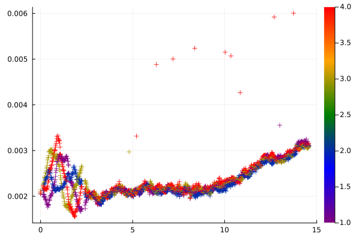
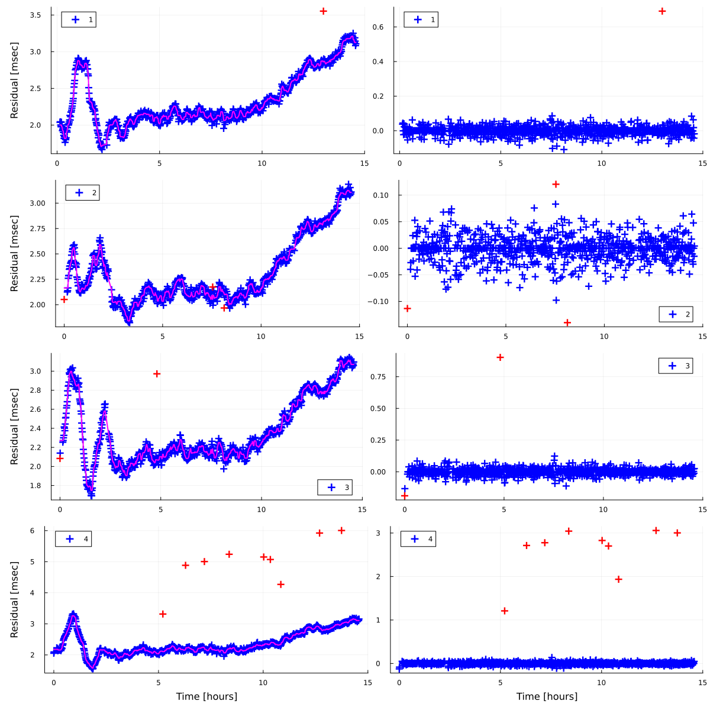

```@meta
CurrentModule = SeaGap
```

# Outlier removal

GNSS-A data often cotain outliers, especially in travel-time data. 
Here, a simple noise removal function `denoise()` is introduced. This function firstly calculate travel-time residuals and then apply a filter (running median or average filter `runmed()` or `runave()`) to time-series of the travel-time residuals. After removing the filtered time-series from the original travel-time residual time-series, `denoise()` eliminates outliers that beyond the range of muliplied standard deviation.
The results of the noise removal are automatically visualized, and you can select to accept the removal or not.

First, you have to prepare the basic input files denoted in "Dataformat": "tr-ant.inp", "pxp-ini.xyh", "ss\_prof.zv", and "obsdata.inp".

Before performing `denoise()`, we calculate travel-time residuals by `ttres(lat,XDUCER_DEPTH; fn1,fn2,fn3,fn4,save)`.
`lat` is the site latitude, `XDUCER_DEPTH` is the average depth of a sea-surface transducer (also see [Forward calculation](forward.md)). `fn1`, `fn2`, `fn3`, and `fn4` are the file names of "tr-ant.inp", "pxp-ini.xyh", "ss\_prof.zv", and "obsdata.inp". Note that the file names can be optionally changed. If you use the default file names, you do not have to use these arguments.  

```julia
using Plots
lat = 36.15753; XDUCER_DEPTH = 3.0
nv,kv,t1,t2,tp,tc,tr,vert = SeaGap.ttres(lat,XDUCER_DEPTH)
scatter(t1,tr,markershape=:cross,zcolor=kv,label=:none,c=:rainbow)
```

`nv` is the shot number, `kv` is the seafloor transponder number, `t1` is the transmitted time, `t2` is the receieved time, `tp` is the observed travel-times, `tc` is the calculated travel-times assuming the seafloor positions wriiten in "pxp-ini.xyh", `tr` is the reavel-time residuals, and `vert` is the mapping functions (see [Forward calculation](forward.md)).

The plots of the travel-time residuals are obtained by `Plots.scatter()` (X: the transmitted time, Y: the travel-time residuals, Color: the seafloor transponder number).

```@raw html

```

The travel-time residuals of the all transponders show a similar trend after the time of 3 hours when the sea-surface platform had been at a fixed point (refer the figures in Dataformat).
This trend is considered to be temporal fluctuation of the sound speed structure, and the offset of the residuals could be caused due to non-optimization of the transponder array position in this calculation.
Meanwhile, the travel-time residuals show different trends before the time of 3 hours depending on the sea-surface positions; this generally due to non-optimization of the transponder array position in this calculation and spatial heterogenity of a sound speed structure.
From the above figure, you can see several outliers, mostly for the 4th transponder.

Then, let's perform `denoise()`.
The following is an example to run the function:

```julia
lat = 36.15753; XDUCER_DEPTH = 3.0
SeaGap.denoise(lat,XDUCER_DEPTH,k=0,n=7,sigma=4.0,method="median")
```

As well as `ttres()`, you can assign the file names by `fn1`, `fn2`, `fn3`, and `fn4`; they correspond to "tr-ant.inp", "pxp-ini.xyh", "ss\_prof.zv", and "obsdata.inp".


After running this in REPL, a figure is shown such as following:

```@raw html

```

The blue plots on each left panel show the travel-time residuals of each transponder.
The red curve of each left panel indicates the filtered time-series of the travel-time residuals.
The filtered time-series is calculated by a running filter (`method="median"`: a running median filter, `method="ave"`: a running average filter) with a running window of `n` samples.

The right panels show the travel-time residuals subtracting the filtered time-series.
The red plots are identified as outliers beyond a range of the `sigma`-multipled standard deviation.

After this prcossing, the following message is shown:

```
Do you accept the denoise processing? (yes/no):
```

If you type "yes", "obsdata.inp" (`fn4`) is replaced with new "obsdata.inp" (`fn4`) without the outliers.
If you type "no", "obsdata.inp" (`fn4`) is unchanged.
If you'ld like to the orginal "obsdata.inp" when selecting "yes", you can save the original "obsdata.inp" as `fn0` (an optional file name) with setting `save=true`:

```julia
SeaGap.denoise(lat,XDUCER_DEPTH,k=0,n=7,sigma=4.0,method="median",save=true,fn0="original_obsdata.inp")
```


If you'd like to run `denoise()` without the above interaction (typing "yes" or "no"), you should set "prompt=false".
In this case, "obsdata.inp" (`fn4`) is replaced with new "obsdata.inp" (`fn4`) without the outliers.
Thus, `save=true` and `show=false` options are recommended; the original "obsdata.inp" is saved as `fn0` and the figure is saved as `fno2`.

```julia
SeaGap.denoise(lat,XDUCER_DEPTH,k=0,n=7,sigma=4.0,method="median",prompt=false,save=true,fn0="original_obsdata.inp",show=false,fno2=`denoise.png`)
```


If you set `k=0`, the outlier removal processing is performed for all transponders.
If you set `k` with the other interger number (such as `k=2`), the outlier removal processing is performed for the `k`th transponder.  

Note that the processing results of `denoise()` is also recorded as a text file named `fno1` (the defalut is `fno1="denoise.out"`), which shows (1: the shot number, 2: the transponder number, 3: the transmitted time [sec], 4: the travel-time residual, 5: the filtered travel-time residual, 6: difference between [4] and [5], 7: the outlier identifier [0: remain, 1: outlier]).

If all outliers are not removed by single performance of `denoise()`, you should repeatedly perform `denoise()` and obtain cleaned "obsdata.inp".


