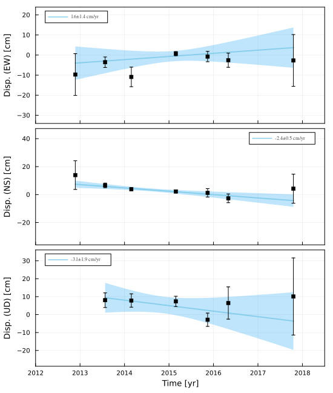
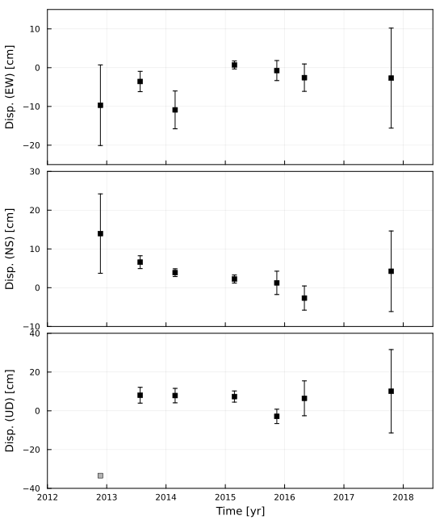

```@meta
CurrentModule = SeaGap
```

# Time-series analysis

After positioning multiple campaign, you would perform time-series analysis for assessing crustal deformation.
The general positioning results are shown in "position.out" by `pos_array_all()` or `pos_array_mcmcpvg()`.
You can obtain time-series of the array displacements by merging the "position.out" for multiple campaigns.

But, you should correct a stable plate motion to consider long-term crustal deformation (e.g., inter-/post-seismic deformation).
After the correction, it is generally performed to calculate a displacement rate.

SeaGap provides functions to arrange (including a function to elimiate a constant velocity) the merged "position.out" and to calculate an array displcament rate.

First, let's prepare the merged "position.out" as "position\_merge.out".

**$ cat position_merge.out**
```
406823232 -0.096889228 0.139634124 -0.334569674 0.01040281 0.01023568 0.31545639
427997740 -0.023633200 0.053856194 0.080438784 0.00262383 0.00164626 0.00407914
446630293 -0.086322921 0.016209885 0.078556148 0.00487531 0.00100381 0.00372393
478175535 0.047437107 -0.018050471 0.073543488 0.00103975 0.00104308 0.00287912
500691126 0.045814082 -0.040725985 -0.028688630 0.00258226 0.00301437 0.00371223
515402741 0.035828374 -0.088293375 0.064555567 0.00352865 0.00311975 0.00899014
561563695 0.060865355 -0.045373625 0.101002939 0.01289510 0.01039353 0.02149323
```

Then, the merged position file should be arranged, and a constant velocity (a stable plate motion) should be eliminated.
These can be performed by `convert_displacement(vx,vy,vz;redu,sredu_hor,sredu_ver,fno,fn,t0)`.
* vx, vy, vz: constant velocities which are eliminated from the time-series (Unit: cm/yr)
* redu: if `redu=true`, the large estimation errors are identified as unusable (estimation errors in EW and NS components > `sredu_hor`; those in UD component > `sredu_ver`); if `redu=false`, all are identified as usable
* sredu\_hor: Estimation error limit to be usable for horizontal components (`sredu_hor=30.0` [cm] in default)
* sredu\_ver: Estimation error limit to be usable for vertical component (`sredu_ver=30.0` [cm] in default)
* fno: Arranged time-series file ("converted\_position.out" in defalult)
* fn: Input time-series file ("position\_merge.out" in defalult)
* t0: Reference time ("2000-01-01T12:00:00" in default; refer Date & Time processing [e.g., `sec2year()`])

```julia
SeaGap.convert_displacement(1.79,-1.79,0.0,sredu_hor=30.0,sredu_ver=30.0,fno="converted_position.out")
```

**$ cat converted_position.out**
```
# Year DispX DispY DispZ SigmaX SigmaY SigmaZ UsableX UsableY UsableZ (detrend 1.79 -1.79 0.0)
2012.89344 -9.689 13.963 -33.457 1.040 1.024 31.546 1 1 0
2013.56438 -3.564 6.587 8.044 0.262 0.165 0.408 1 1 1
2014.15342 -10.888 3.876 7.856 0.488 0.100 0.372 1 1 1
2015.15342 0.698 2.240 7.354 0.104 0.104 0.288 1 1 1
2015.86849 -0.744 1.253 -2.869 0.258 0.301 0.371 1 1 1
2016.33333 -2.575 -2.672 6.456 0.353 0.312 0.899 1 1 1
2017.79726 -2.691 4.240 10.100 1.290 1.039 2.149 1 1 1
```

As shown above, the cumulative time [sec] is converted into AD [year] \(Column 1);
 units of the array displacements and thier estimation errors [m] are converted into [cm] \(Columns 2-7);
 constant velocities (vx,vy,vz) are eliminated from the array displacements (Columns 2-4);
 Columns 8-10 indicate usable/unusable (1/0) for each component.
It doen't matter to produce this file your own way.

Using "converted\_position.out", `plot_displacement(ts,te,EW_range,NS_range,UD_range;autoscale,pscale,cal,weight,predict,fno1,fno2,fno3,fn,show)` calculates an array displacement rate for each component and make a figure.
* ts: Start time of the figure (Time at the left edge of the figure) [yr]
* te: End time of the figure (Time at the right edge of the figure) [yr]
* EW\_range, NS\_range, UD\_range: If `autoscale=false`, the range of Y-axis is set to be those ranges
* autoscale: if `autoscale=true` (default), the range of Y-axis is automatically determined depending on the usable array displacements
* pscale: if you set smaller value, the autoscale Y-axis range is wider (`pscale=0.5` in default)
* cal: if `cal=true`, a regression line is calculated for each component, is shown in the figure, and the regression results are written in `fno2` as a text file
* weight: if `weight=true`, the regression line is calculated considering the weight; the weight is provided as an inverse square of the observation error (`weight=true` in default)
* predict: if `predict=true`, the predicted values from the regression line are written in "`fno3`-EW.txt", "`fno3`-NS.txt", and "`fno3`-UD.txt"
* fno1: Output figure name
* fno2: Name of an output text file showing array displacement rates
* fno3: Indicator name of output text files showing the predicted values from the regression lines
* fn: Input file name ("converted\_position.out")
* show:  If `show=false`, the figure is saved as `fno` (`fno` is name of the output figure). If `show=true` in REPL, a figure is temporally shown.

```julia
SeaGap.plot_displacement(2012,2018.5,fno1="displacement.png")
```

```@raw html

```

```julia
SeaGap.plot_displacement(2012,2018.5,(-25,15),(-10,30),(-40,40),fno1="displacement_wo.png",autoscale=false,cal=false)
```

```@raw html

```

The thick blue line shows a regression line for each component, and the shaded portion shows a 95% confidence interval.
Glay and black squares are the unusable and usable array displacements, respectively.

The regression results are given as following:

**$ cat velocity.out** (`fno2`) 
```
# (Vx,Vy,Vz,Sx,Sy,Sz,RMSx,RMSy,RMSz,CorXY) in cm Linear model
1.5742551020532471 -2.3877121258416882 -3.0700998568383113 1.3995537945799512 0.5303522727297605 1.8953362710629817 11.569073350333905 6.4632288773323445 9.787610128634833 -0.3291858072408599 7 7 6
```

**$ cat predict-EW.txt** (`fno3`)
```
# Year Disp. Pred. Residual Sigma
 2012.89344   -9.689  -4.025397254303815   -5.663602745696185   1.04
 2013.56438   -3.564  -2.969166536132252   -0.5948334638677482  0.262
 2014.15342  -10.888  -2.0418673108187     -8.8461326891813     0.488
 2015.15342    0.698  -0.4676122087654528   1.1656122087654528  0.104
 2015.86849   -0.744   0.6580903870597136  -1.4020903870597134  0.258
 2016.33333   -2.575   1.389867128697936   -3.9648671286979362  0.353
 2017.79726   -2.691   3.6944664002469327  -6.385466400246933   1.29
```

