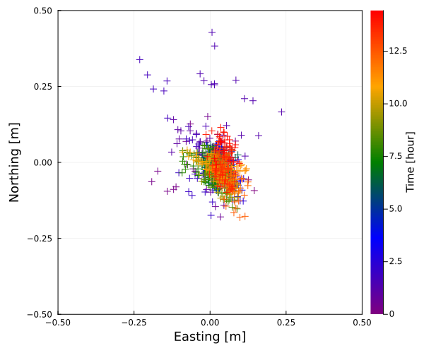
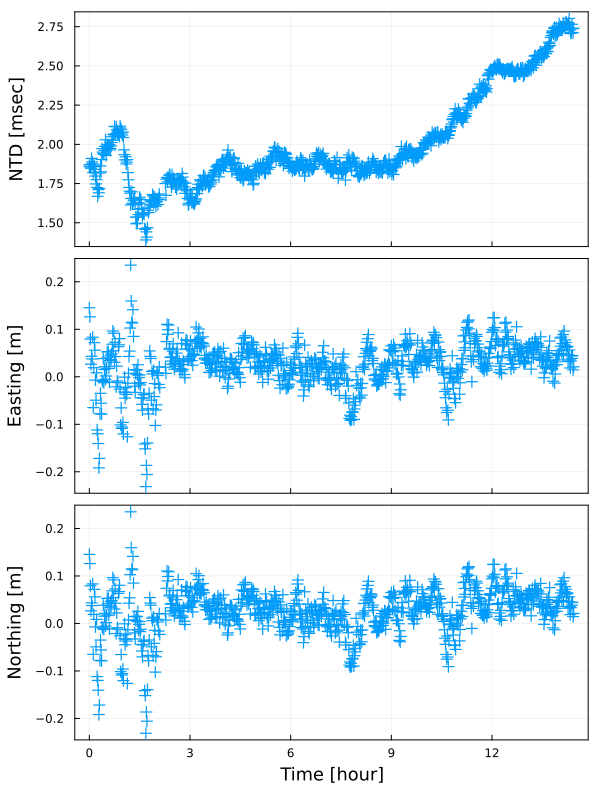

```@meta
CurrentModule = SeaGap
```

# Kinematic array positioning


In SeaGap, the kinematic positioning function (`pos_array_each`) based on [Kido et al. (2006)](https://earth-planets-space.springeropen.com/articles/10.1186/BF03351996) and [Kido et al. (2008)](https://earth-planets-space.springeropen.com/articles/10.1186/BF03352785) is provided. A kinematic array position can be estimated for each shot group by Gauss-Newton method.
 
## Input data

To perform `pos_array_each`, you have to prepare four input files denoted in "Dataformat": "tr-ant.inp". "pxp-ini.xyh", "ss\_prof.zv", and "obsdata.inp". Outliers in "obsdata.inp" should be removed in advance; SeaGap includes a simple [outlier removal](denoise.md) function. 

In "obsdata.inp", you have to write the shot group number.

**$ head obsdata.inp**
```
1 3.932951 500664917.000000 328.924820 253.690718 28.230250 -52.76000 -1.08760 -4.84800 500664923.030102 332.595337 256.316298 27.751791 -52.68875 -0.89626 1.21533 3
3 4.357953 500664917.000000 328.924820 253.690718 28.230250 -52.76000 -1.08760 -4.84800 500664923.455105 332.635629 256.224942 28.223725 -52.71458 -1.45692 -0.33433 3
4 4.113388 500664917.000000 328.924820 253.690718 28.230250 -52.76000 -1.08760 -4.84800 500664923.210540 332.613304 256.277211 27.956819 -52.70038 -1.13751 0.54746 3
1 3.915718 500664977.000000 373.035589 269.760505 26.578150 -67.98040 0.74000 1.68840 500664983.012870 378.677857 271.831665 27.544478 -71.14971 -1.07657 -0.09575 4
3 4.385641 500664977.000000 373.035589 269.760505 26.578150 -67.98040 0.74000 1.68840 500664983.482792 379.056560 272.006605 28.023320 -71.32463 -1.99330 0.01337 4
4 4.107478 500664977.000000 373.035589 269.760505 26.578150 -67.98040 0.74000 1.68840 500664983.204630 378.829072 271.903686 27.752693 -71.21717 -1.48302 -0.05251 4
1 3.891855 500665037.000000 433.056625 301.790116 28.075250 -102.24360 -2.02200 -0.07680 500665042.989008 438.912558 305.954410 27.484275 -104.12427 -1.15657 0.14795 5
3 4.431185 500665037.000000 433.056625 301.790116 28.075250 -102.24360 -2.02200 -0.07680 500665043.528337 439.559126 306.314161 27.384643 -104.49262 -0.77367 -0.75093 5
4 4.106340 500665037.000000 433.056625 301.790116 28.075250 -102.24360 -2.02200 -0.07680 500665043.203493 439.166251 306.086586 27.453858 -104.25092 -1.02985 -0.21190 5
1 3.864128 500665097.000000 498.198875 338.484885 27.308750 -100.24200 -0.04560 1.64200 500665102.961280 506.226386 341.946760 29.059762 -99.11188 -3.00132 1.92119 6
```

The last column shows the shot group number.
`pos_array_each()` estimates a horizontal array position using the data with each shot number if number of the observational data lines are more than `NR` (`NR=3` in default, but you cannot assign `NR`<2 because number of unknown paramters is 3).
The detailed format of "obsdata.inp" are shown in "Dataformat" tab. 


## Estimation

You can simply perform `pos_array_each` as following: 

```julia
lat=36.15753; XDUCER_DEPTH=5.0
SeaGap.pos_array_each(lat,XDUCER_DEPTH)
```

The input files are `fn1`, `fn2`, `fn3`, and `fn4`; they correspond to "tr-ant.inp". "pxp-ini.xyh", "ss\_prof.zv", and "obsdata.inp" in default.

Then, after performing, you obtained a log file as `fno0` (`fno0="log.txt"` in default), a position file `fno1` (`fno1="array_each.out"` in default), and a data misfit file `fno2` (`fno2="residual_each.out"`).
 

"array\_each.out" show (1: the transmitting time [sec], 2: number of the used observational data for each shot group, 3: Easting displacement [m], 4: Northing displacement [m], 5: NTD [sec], 6: Std. of Easting disp. [m], 7: Std. of Northing disp. [m], 8: 6: Std. of NTD [sec], 9: the shot group number). Note that 6-8 columns show "Inf" if number of the used observational data is 3.

**$ head array_each.out**
```
5.00664917e8 3 0.1453633877852824 -0.09278934666794787 0.001861163617159608 Inf Inf Inf 3
5.00664977e8 3 0.12614038874488606 -0.057422633767672655 0.0018715189289275115 Inf Inf Inf 4
5.00665037e8 3 0.07936571170266186 -0.05687149763887808 0.0018551728738569694 Inf Inf Inf 5
5.00665097e8 3 0.0264715534964957 -0.008771078117542352 0.001847548147532196 Inf Inf Inf 6
5.00665157e8 4 0.04316895253575775 0.023535453720761355 0.001910133990558378 0.00256471661166177 0.0024299635683038513 1.0369446952118624e-6 7
5.00665217e8 4 0.03786988717360014 0.05047262924984068 0.0018880334236326785 0.029162706657460933 0.028602444637499756 1.225134599144191e-5 8
5.00665277e8 4 0.0820308602739349 0.06974247032181959 0.0018764066023373308 0.06451632308678762 0.05953740233678682 2.702672824962262e-5 9
5.00665337e8 3 -0.06495578410464437 0.12644569423179428 0.0018195955053809194 Inf Inf Inf 10
5.00665397e8 4 0.019562081098463194 0.05730593122968437 0.001867836110354499 0.0492365518347607 0.0427912450102088 2.1891838113411593e-5 11
5.00665457e8 4 0.07189823454093269 0.03975598136588962 0.0018583240316095582 0.04355482260295224 0.03805680609681681 1.9584956095819914e-5 12
```
 

"residual\_each.out" show (1: the transmitted time, 2: the transponder number, 3: misfit [sec], 4: number of interations, 5: the shot group number, 6: number of the used data). If the number of the used data is 3, the misfits are almost zero.

**$ head -n 16 residual_each.out**
```
5.00664917e8 1 1.0842021724855044e-18 3 3 3
5.00664917e8 3 -2.168404344971009e-19 3 3 3
5.00664917e8 4 -2.168404344971009e-18 3 3 3
5.00664977e8 1 1.951563910473908e-18 4 4 3
5.00664977e8 3 -1.951563910473908e-18 4 4 3
5.00664977e8 4 -1.734723475976807e-18 4 4 3
5.00665037e8 1 4.9873299934333204e-18 3 5 3
5.00665037e8 3 -1.1275702593849246e-17 3 5 3
5.00665037e8 4 1.0842021724855044e-18 3 5 3
5.00665097e8 1 1.3010426069826053e-18 3 6 3
5.00665097e8 3 -6.5052130349130266e-18 3 6 3
5.00665097e8 4 6.7220534694101275e-18 3 6 3
5.00665157e8 1 6.248285661649648e-7 3 7 4
5.00665157e8 2 -8.073841889170291e-7 3 7 4
5.00665157e8 3 9.097131878365878e-7 3 7 4
5.00665157e8 4 -7.271575650853908e-7 3 7 4
```
 

You can change the following inversion criterion values by keyword arguments, such as:
```julia
SeaGap.pos_array_each(lat,XDUCER_DEPTH,delta_pos=1.e-5)
```

* `eps`: Convergence criteria [m], the default is 1.e-4 (each inversion is converged when RMS of difference between the previous and the new solutions of the horizontal array displacements < `eps`)
* `ITMAX`: Maximum number of interations, the default is 20
* `delta_pos`: Infinitesimal amount of the array positions to calculate the Jacobian matrix, the default is 1.e-4 [m]


## Visualization 

If you'd like to plot the array positions in a horizontal map, you can use `plot_map_array_each(xrange,yrange; autoscale,fn,fno,show,col_num)` function.
* If `autoscale=true` (default), the plot range is automatically determined. If `autoscale=false`, the plot range is fixed by `xrange` and `yrange`.
* `fn` is the input file name: "array\_each.out" in default.
* If `show=false`, the figure is saved as `fno` (`fno` is name of the output figure). If `show=true` in REPL, a figure is temporally shown.
* If `col_num=1` (default), the plot is colored by the observation time. If `col_num=2`, the plot is colored by number of the used observational data. If `col_num=0`, the plot is colored by blue. 

```julia
SeaGap.plot_map_array_each((-0.5,0.5),(-0.5,0.5),autoscale=false,fno="map_array_each.png")
```

```@raw html

```

If you'd like to plot the array positions in time-series, you can use `plot_time_array_each(EW_range,NS_range.ntdrange.autoscale,fn,fno,show)` function.
* If `autoscale=true` (default), the plot range is automatically determined. If `autoscale=false`, the plot range of y-componet is fixed by `EW_range`, `NS_range`, and `ntdrange`. The range of x-compoent (Time) is automatically determined in the both cases.
* `fn` is the input file name: "array\_each.out" in default.
* If `show=false`, the figure is saved as `fno` (`fno` is name of the output figure). If `show=true` in REPL, a figure is temporally shown.


```julia
SeaGap.plot_time_array_each(fno="time_array_each.png")
```


```@raw html

```


