```@meta
CurrentModule = SeaGap
```

# MCMC array positioning

## Make initial value file

In order to perform the static array positioning considering a sound speed gradient through a MCMC technique ([Tomita & Kido, 2022](https://earth-planets-space.springeropen.com/articles/10.1186/s40623-022-01740-0)), we have to prepare an initial value file (named "initial.inp" in default) which lists initial values of the unknown parameters for MCMC optimization.

The dataformat of "initial.inp" is (Columns 1: Initial value, 2: Lower limit, 3: Upper limit, 4: Step width, 5: Parameter name).
The step width is used as perturbation when new parameter candidates are produced in the MCMC sampling.
This should be appropriately given to effectively perform a MCMC sampling.
 
The type of unknown parameters to be placed on each line of this file is fixed and cannot be changed.
* Lines 1-3: Array displacements for EW, NS, UD [m]
* Lines 4-5: Shallow gradients for EW, NS [sec/km]
* Line 6: Gradient depth [km]
* Lines 7-11: Long-term NTD modeled by 4th polynomial function (degree: 0-4)
* Lines 12-13: Scale factor optimizing observational errors
* Lines 14-: Coefficinets for the 3d B-spline bases (Short-term NTD)

This file can be produced by `make_initial(fn1,fn2,fn3,fno,error_scale)` function.
`fn1` is the initial seafloor transponder positions: "pxp-ini.xyh".
`fn2` and `fn3` are "ntd.out" and "solve.out", respectively; they are obtained by [the basic static array positioning](tstatic.md) `pos_array_all()`.
`error_scale` is used for providing the step width (`error_scale=5.0` in default).
`make_initial()` provides the step widths as (``1\sigma`` standard deviation / `error_scale`) for the parameters at Lines 1-3, 7-11, and 14-.
 
```julia
SeaGap.make_initial(fn1="pxp-ini.xyh",fn2="ntd.out",fn3="solve.out",fno="initial.inp",error_scale=5.0)
```

$ head -n 20 initial.inp 
```
0.030187510738829797 -20 20 0.000321268998116478 EW_disp.
-0.017200785437164808 -20 20 0.0003204201142000086 NS_disp.
0.041056999118875934 -20 20 0.0011705986999643245 UD_disp.
0 -20 20 1.e-6 S-Gradient_EW
0 -20 20 1.e-6 S-Gradient_NS
0.65 0 2.7056096662950706 0.003 Gradient_depth
0.001926966300227448 -20 20 1.5834887346403067e-6 L-NTD_1
-6.645212668710516e-5 -20 20 1.5317937174687443e-6 L-NTD_2
1.376759486440472e-5 -20 20 4.321599672129574e-7 L-NTD_3
-1.0818152019511877e-6 -20 20 4.49314117280274e-8 L-NTD_4
5.3511728156856244e-8 -20 20 1.5413419988334485e-9 L-NTD_5
0 -20 20 0.005 Scale_1
0 -20 20 0.005 Scale_2
0.0010647476480386791 -20 20 3.503253752448373e-5 S-NTD_1
0.002151559316822114 -20 20 6.37847806976361e-6 S-NTD_2
0.0017068866360801726 -20 20 3.3017370591590338e-6 S-NTD_3
0.0019755794522729655 -20 20 2.647153534948832e-6 S-NTD_4
0.0020457446445436914 -20 20 2.5638873591818526e-6 S-NTD_5
0.0021441954994986263 -20 20 2.4741186962746727e-6 S-NTD_6
0.0020924782933203438 -20 20 2.5033734582093735e-6 S-NTD_7
```

If you provide same values for the columns 1-3 at a certain line, the corresponding parameter is handled as a constant parameter.
For example, when you provide "0.65" for the columns 1-3 at the 6th line, you can estimate an array displacement with the gradient depth is fixed to 650 m.

## Run MCMC processing

Before you run `pos_array_mcmcpvg()`, you have to set number of threads for the thread parallelization in your terminal as:

**$ export JULIA_NUM_THREADS=4**

or you have to run Julia as:

**$ julia -t 4**

This value is determined depending on your machine ability.

Then, after setting the above thread number and preparing the above input files, you can perform `pos_array_mcmcpvg(lat,XDUCER_DEPTH,NPB; nloop,nburn,NA,scalentd,delta_scale,fn1,fn2,fn3,fn4,fn5,fno0,fno1,fno2,fno3,fno4,fno5,fno6,fno7)` function as following:

```julia
lat=36.15753; XDUCER_DEPTH=5.0; NPB=77
SeaGap.pos_array_mcmcpvg(lat,XDUCER_DEPTH,NPB) 
```

Meanings of the arguments of `pos_array_mcmcpvg()` are following:
* lat: Latitude of the site
* XDUCER\_DEPTH: Depth of the sea-surface transducer from the sea-surface [m]
* NPB: Number of the 3d B-spline bases (this should be optimized in the conventional static array positioning `pos_array_all_AICBIC()`)
* nloop: Total number of the MCMC iterations (1200000 in default)
* nburn: Burn-in period of the MCMC iterations (samples less than `nburn` is excluded from the final results; 200000 in default)
* NA: Number of the sampling interval (5 in default; if you set (`nloop=1200000`, `nburn=200000`, and `NA=5`), you can obtain ``(1200000 - 200000) / 5`` samples)
* scalentd: "true" or "false", which turn on/off the scaling procedure for the parameters for the long-term NTD polynomial functions (true in default)
* delta\_scale: the step width for the scaled long-term NTD parameters if `scalentd=true` (0.001 in default)
* fn1-5: the input file names ("tr-ant.inp", "pxp-ini.xyh", "ss\_prof.zv", "obsdata.inp", and "initial.inp")
* fno0: the log file ("log.txt" in default)
* fno1-7: the output file names ("sample.out", "mcmc.out", "position.out", "statistics.out", "acceptance.out", "residual\_grad.out", and "bspline.out")

Note that `pos_array_mcmcpvg()` has a function to perform a variable transformation for the 4th polynomial functions.
Since these parameters tends to have very small values, it is better to do the variable transformation.
The log-scaling or exponential-scaling are often performed for a variable transformation, but they cannot express negative values.
Then, SeaGap introduces an original transformation function.

```math
x_{\rm org}=x\times10^{|x|+s}
```

Here, ``x_{\rm org}`` is the original value, and ``x`` is the transformed value.
``s`` is a scaling factor, which almost corresponds to an exponent.
This transformation is calculated by `scale(x,s)`.

For examples,
```julia
SeaGap.scale(0.0,-7.0)
 0.0

SeaGap.scale(0.1,-7.0)
 1.2589254117941663e-8

SeaGap.scale(-1.0,-7.0)
 -1.0e-6
```

Dependency of the scaling factor of the variable transformation is shown below.


```@raw html
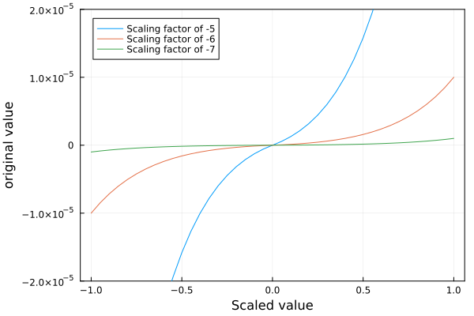
```

You can obtain the transformed value form the original value by `scale_est(x0,s)`.
`x0` is  the original value.
Note that `x0` and `s` must be given as a vector type.

```julia
SeaGap.scale_est([1.e-7],[-6.0])
1-element Vector{Float64}:
 0.08266713144257666
```

In `pos_array_mcmcpvg()` with `scale=true`, the initial values at the lines 7-11 in "initial.inp" (corresponding to the 4th polynomial functions) are transformed into the scaled values,the scaled values are optimized.
Then, the scaled values are retransformed before they are written in the output files. 
The scaling factor is determined as ``log10()`` of the step width written in "initial.inp".

## Output text files
---
**`fno0`: the log file, which shows the analytical conditions, and so on**

**$ head log.txt**
```
2023-01-17T19:00:41.919
pos_array_mcmcpvg.jl at /Users/test_PC/SeaGap_test/mcmc
Number of threads: 4
Number_of_B-spline_knots: 77
Default_latitude: 36.15753
XDUCER_DEPTH: 5.0
Number_of_MCMC_loop: 1200000
Burn_in_period: 200000
Sampling_interval: 5
Scale: true
```

--- 
**`fno1`: The sampled unknown parameters ("sample.out" in default)**

In this file, the unknown parameter names written in "initial.inp" is written at the first line.
Then, the sampled parameters for each MCMC iteration at each line.

**$ head sample.out | awk '{print \$1,\$2,\$3,\$4,\$5,\$6}'**
```
EW_disp. NS_disp. UD_disp. S-Gradient_EW S-Gradient_NS Gradient_depth
0.08260468443394334 -0.08662247961124432 0.025670510288264305 -8.771624335364252e-5 0.00010961686642287733 1.2503597971928924
0.08267622275159063 -0.08659985681012972 0.025576618792931577 -8.771624335364252e-5 0.00010961686642287733 1.2514668834253768
0.08267622275159063 -0.08659985681012972 0.025576618792931577 -8.771624335364252e-5 0.00010961686642287733 1.2514668834253768
0.08257816202610356 -0.08676586359181068 0.026364029769176674 -8.662376786583694e-5 0.00011008075308089754 1.2545419670486935
0.08273477250197107 -0.08691447522787146 0.026473029376261083 -8.601645266995016e-5 0.00011039835525118065 1.256823862187269
0.08273477250197107 -0.08691447522787146 0.026473029376261083 -8.586850303156531e-5 0.00011032251120277963 1.256823862187269
0.08296086785894285 -0.08690636056269939 0.026105616785332967 -8.601882619337507e-5 0.00011100358125704938 1.2539045990938986
0.08296086785894285 -0.08690636056269939 0.026105616785332967 -8.575844791557426e-5 0.00011146701700201295 1.2539045990938986
0.08296086785894285 -0.08690636056269939 0.026105616785332967 -8.575844791557426e-5 0.00011146701700201295 1.2539045990938986
```

---
**`fno2`: The PDFs and RMS ("mcmc.out" in default)**

In this file, the PDF and RMS values for each MCMC iteration are recorded.
- 1: Iteration number
- 2: Process number (0 and 1 corresponds to optimization for observation equations 1 and 2, respectively)
- 3: Acceptance (0 and 1 are reject and accept the MCMC perturbation, respectively)
- 4: The posterior PDF for the observation equation 1
- 5: The posterior PDF for the observation equation 2
- 6: The total posterior PDF
- 7: RMS for the observation equation 1
- 8: RMS for the observation equation 2

**$ head mcmc.out** 
```
5 1 0 -172.07488459892824 -1409.6579839265735 -1581.7328685255018 3.338234991326818e-5 9.182030714056993e-5
10 0 0 -155.61914177499887 -1401.3967311431156 -1557.0158729181144 3.339232619776381e-5 9.16151939518422e-5
15 1 0 -155.61914177499887 -1401.3967311431156 -1557.0158729181144 3.339232619776381e-5 9.16151939518422e-5
20 0 1 -137.41091421376203 -1401.376226403875 -1538.787140617637 3.3410538738499884e-5 9.161452963850095e-5
25 1 0 -133.01831863694736 -1391.9801617581804 -1524.998480395128 3.344301817743939e-5 9.134824556321319e-5
30 0 1 -109.29886449002367 -1391.0621556429485 -1500.361020132972 3.347260711004965e-5 9.127132832978736e-5
35 1 0 -109.30483475777382 -1387.2011111207792 -1496.505945878553 3.347311308670593e-5 9.121323544230633e-5
40 0 0 -85.27475239673925 -1379.5576836995147 -1464.8324360962538 3.351642492052818e-5 9.102471441061438e-5
45 1 0 -85.25849887560958 -1376.4199976400157 -1461.6784965156253 3.3515071947666e-5 9.096666320486617e-5
50 0 1 -75.34502498422776 -1376.6926493095564 -1452.0376742937842 3.3526530022277746e-5 9.097539166287877e-5
```

---
**`fno3`: The position file ("position.out" in default)**

This is same format with the "position.out" of `pos_array_all()`.
(1: the cumlative seconds of the observational time, 2-4: Mean array displacements for EW, NS, UD componets, 5-7: Standard deviations of 2-4)

**$ cat position.out** 
```
5.006911621555024e8 0.08911960760365124 -0.09216111977421959 0.03457162712162569 0.003936408533764213 0.0043953798040076006 0.005210189660303897
```

---
**`fno4`: Statistical values for each unknown parameter ("statistics.out" in default)**

**$ head statistics.out**
```
#Parameter mean std median min max
 "EW_disp."         0.08911960760365124     0.003936408533764213     0.0892521976843861       0.07400853233593642      0.10005015563126467
 "NS_disp."        -0.09216111977421959     0.0043953798040076006   -0.09213407404825562     -0.10569075622407245     -0.07838777092762594
 "UD_disp."         0.03457162712162569     0.005210189660303897     0.03449415426052328      0.020518200098452177     0.05212435704281135
 "S-Gradient_EW"   -8.623784806334861e-5    3.126868794994436e-6    -8.626830270790426e-5    -9.798370547851873e-5    -7.330783126090201e-5
 "S-Gradient_NS"    0.00010966667913789561  3.423305146728919e-6     0.00010964007421263047   9.748940165070173e-5     0.00012217847159287033
 "Gradient_depth"   1.4207329666466362      0.07705694064531148      1.423071425054456        1.1953002262535226       1.652638238698269
 "L-NTD_1"          0.001876150125418078    8.450064033018187e-6     0.0018754533333023632    0.0018500354406289293    0.0019026360766405816
 "L-NTD_2"         -2.5573041517503042e-5   6.615899997973998e-6    -2.6145326032410628e-5   -3.98440505121662e-5     -1.3381927457000322e-5
 "L-NTD_3"          4.366073210014821e-6    1.5633246953860986e-6    4.618228804187182e-6     1.6644226647942257e-6    7.839589859898406e-6
```

---
**`fno5`: Acceptance ratio ("acceptance.out" in default)**

The first and second lines show the acceptance ratios for the observation equations 1 and 2, respectively.

**$ cat acceptance.out** 
```
Acceptance_ratio_MCMC-1: 0.2578666666666667
Acceptance_ratio_MCMC-2: 0.29825833333333335
```

Note that it is plausible to adjust the pertubation widths as the acceptance ratio is ~23 % when sampling multiple parameters ([Gelman et al., 1996](https://global.oup.com/academic/product/bayesian-statistics-5-9780198523567?cc=jp&lang=en&#))

---
**`fno6`: Data residuals including the NTD and gradient effects ("residual_grad.out" in default)**

The effects of the modeled NTD and gradients on the data residuals are shown.
- 1: The cumulative seconds of the observational time
- 2: Seafloor transponder number
- 3: EW sea-surface platform positions
- 4: NS sea-surface platform positions
- 5: UD sea-surface platform positions
- 6: Projected travel-time residuals (``\frac{1}{M\left(\xi_{n,k}\right)} T_{n,k}^{\mathrm{obs}}-\frac{1}{M\left(\xi_{n,k}\right)} {T}^{\mathrm{cal}}\left(\mathbf{p}_k+\delta \mathbf{p}, \mathbf{u}\left(t_{n},{\bf b}_0\right), v_0\right)``)
- 7: The modeled NTD by 3d B-spilne function (``\sum_{j=1}^{J}c_j\Phi_j(t_n)``) 
- 8: Effects of the deep gradients (``\frac{D}{2}\mathbf{g}_{\mathrm{s}}\mathbf{h}_{n,k}``)
- 9: The modeled travel-time in the observation equation 1 (7+8)
- 10: The long-term NTD modeled by 4th polynomial funcions (``\sum_{m=0}^{4} \gamma_{m}t^m_n``)
- 11: Effects of the shallow gradients (``\mathbf{g}_{\mathrm{s}} \mathbf{u}^{\mathrm{hor}}\left(t_{n}\right)``)
- 12: The modeled travel-time in the observation equation 2 (10+11)
- 13: The final travel-time residuals (6-9)

**$ head residual_grad.out** 
```
 5.00664920015051e8    1.0    317.26245264634497       266.19938356095884      16.199673254258155  0.0019212227711233381  0.001892028778148772    5.711709219681263e-6    0.0018977404873684533  0.0018746452897521106   2.0683804412705322e-6   0.0018767136701933812   2.3482283754884864e-5
 5.0066492022755253e8  3.0    317.4207663638199        266.23937739269013      16.35391331567538   0.0018695167060979961  0.0018921278087429905  -6.9439073915697634e-6   0.0018851839013514207  0.001874643966433996    2.0591604132395985e-6   0.0018767031268472356  -1.566719525342459e-5
 5.0066492010527e8     4.0    317.33085587257335       266.2167718441425       16.266436850893314  0.001910238971072497   0.001892070840004891   -5.291482671798069e-5    0.0018391560132869102  0.0018746447279249909   2.064408633186119e-6    0.001876709136558177    7.108295778558672e-5
 5.0066498000643504e8  1.0    359.36021854162504       277.1719433446349       15.488230263006805  0.0019366615406645382  0.0019144686268185939   6.375498463855449e-6    0.0019208441252824492  0.001874272705278389   -3.4606306062375273e-7   0.0018739266422177652   1.5817415382088868e-5
 5.00664980241396e8    3.0    359.62778017355595       277.1931975835786       15.588033546421837  0.0018727123843230136  0.0019145357011519687  -6.268209740870233e-6    0.0019082674914110984  0.001874271249971249   -3.6676264921652784e-7   0.0018739044873220326  -3.555510708808484e-5
 5.00664980102315e8    4.0    359.470891440242         277.1805537635656       15.530260681451683  0.0018980540805833112  0.0019144960163931142  -5.225869689302257e-5    0.0018622373195000916  0.0018742721114109082  -3.5464513489993904e-7   0.0018739174662760084   3.581676108321959e-5
 5.00665039994504e8    1.0    418.96775535133213       300.2572711136876       15.772906859928952  0.0019080879768812004  0.001926806731015301    7.083893295900419e-6    0.0019338906243112012  0.0018739021478545597  -2.931128587130523e-6    0.0018709710192674292  -2.5802647430000888e-5
 5.006650402641685e8   3.0    419.2429851616972        300.4599899327145       15.785030565510766  0.0018769432135190322  0.0019268415958954247  -5.551085539969325e-6    0.0019212905103554554  0.0018739004866068342  -2.9324497679321385e-6   0.0018709680368389021  -4.43472968364232e-5
 5.006650401017465e8   4.0    419.0773398733799        300.33635900589996      15.778232162741766  0.0018708333451003824  0.0019268206172822213  -5.1539753890195993e-5   0.0018752808633920254  0.0018739014871903337  -2.931834171213654e-6    0.00187096965301912    -4.447518291642887e-6
 5.0066509998064e8     1.0    485.0554895986015        337.2990947633136       16.195343692732713  0.0019027879344541735  0.0019305064012347809   7.522151899566477e-6    0.0019380285531343474  0.0018735336021151463  -4.533172999986541e-6    0.0018690004291151599  -3.5240618680173845e-5
```
---
**`fno7`: ("bspline.out" in default)**

Format of this file is same  with that of `pos_array_all()`.

**$ head bspline.out** 
```
1 1 5.0066421474273527e8 0.0010247469234456984
2 2 5.00664917e8 0.002156372454933342
3 3 5.0066561925726473e8 0.0016934114443747184
4 4 5.006663215145295e8 0.001981011662486047
5 5 5.0066702377179426e8 0.0020508606778729477
6 6 5.0066772602905905e8 0.0021638528570003014
7 7 5.006684282863238e8 0.0021005633614545435
8 8 5.006691305435885e8 0.0017761347727778315
9 9 5.006698328008533e8 0.0017539447798233336
10 10 5.0067053505811805e8 0.0016140641744398039
```

## Visualization

SeaGap prepares various functions to visualize results of the MCMC processing.

### Posterior PDF and RMS variation through the MCMC iteration

When you'd like to check how the posterior PDF and the travel-time RMS change through the MCMC iteration, you can draw by `plot_mcmcres(;fn,fno,show,nshuffle)`. 
* fn: the input file name (`fn="mcmc.out"` in default)
* fno: Output figure name (`fno="mcmc_res.pdf"` in default)
* show: if `show=true`, a figure is shown on REPL and is not saved as a file (`show=false` in default)
* nshuffle: number of plots (if all samples are plotted, the figure is crowded; thus, `nshuffle` of samples are randomly picked; if `nshuffle=0`, all samples are plotted; `nshuffle=50000` in default)
You can adjust the fontsizes or figuresize by the other arguments.

```julia
SeaGap.plot_mcmcres(fno="mcmc_res.pdf")
```

```@raw html
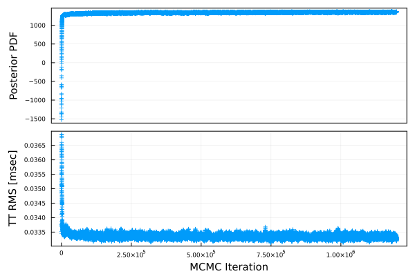
```

### Parameter variation through the MCMC iteration

When you'd like to check how the unknown parameters change through the MCMC iteration, you can draw by `plot_mcmcparam(NA;fn,fno,show,nshuffle)`.
* NA: Sampling interval of the MCMC prcessing (`NA=5` in default), which must be same with `NA` in `pos_array_mcmcpvg`
* fn: the input file name (`fn="sample.out"` in default)
* fno: Output figure name (`fno="mcmc_param.pdf"` in default)
* show: if `show=true`, a figure is shown on REPL and is not saved as a file (`show=false` in default)
* nshuffle: number of plots for each parameter (if all samples are plotted, the figure is crowded; thus, `nshuffle` of samples are randomly picked; if `nshuffle=0`, all samples are plotted; `nshuffle=10000` in default)
You can adjust the fontsizes or figuresize by the other arguments.

```julia
SeaGap.plot_mcmcparam(5,fno="mcmc_param.pdf")
```

```@raw html
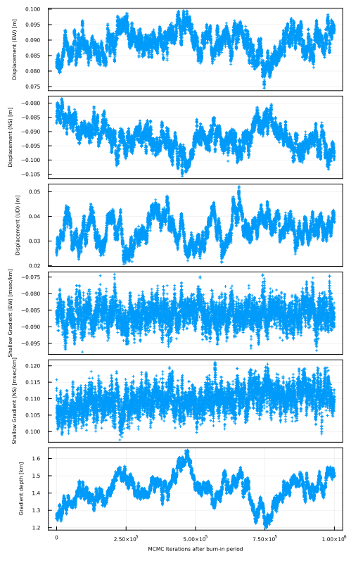
```

In this function, major six unknown parameters are shown.
If you'd like to draw a figure for the other paramters, you can use `plot_mcmcparam_each(param,NA;fn,fno,show,nshuffle)`.
`param` is the parameter name written in "initial.inp".

```julia
SeaGap.plot_mcmcparam_each("S-NTD_10",5,fno="mcmc_param_S-NTD_10.png")
```

```@raw html
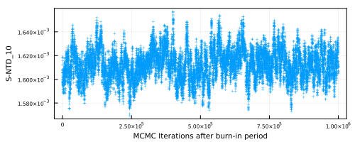
```

### Correlation among the unknown parameters

When you'd like to simply check the trade-off relationship among the unknown parameters, you can draw a correlation map by `plot_cormap(fn,fno0,fno,show,txt,all,as,pfs,plot_size)`.
* fn: the input file name (`fn="sample.out"` in default)
* fno0: Output text data file name (if `txt=true`, correlation coefficients are save in this file; `fno0="correlation.out"`)
* fno: Output figure name (`fno="cormap.pdf"` in default)
* show: if `show=true`, a figure is shown on REPL and is not saved as a file (`show=false` in default)
* txt: Text data file output (`txt=false` in default)
* all: if `all=true`, correlation coefficients are calculated for all parameters; if `all=false`, correlation coefficients are calculated for major paramters (array displacements, shallow gradients, gradient depth)
* as: Fontsize of parameter names (`as=10` in default)
* pfs: Fontsize of annotated correlation values (`pfs=8` in default)
* plot\_size: Figure size (`plot_size=()` in default)

```julia
SeaGap.plot_cormap(fno="cormap.png")
```

```@raw html

``` 

If you set as following:

```julia
SeaGap.plot_cormap(all=true,fno="cormap_all.png",plot_size=(1400,1400),txt=true)
```

you obtain the below figure and the output text data

```@raw html
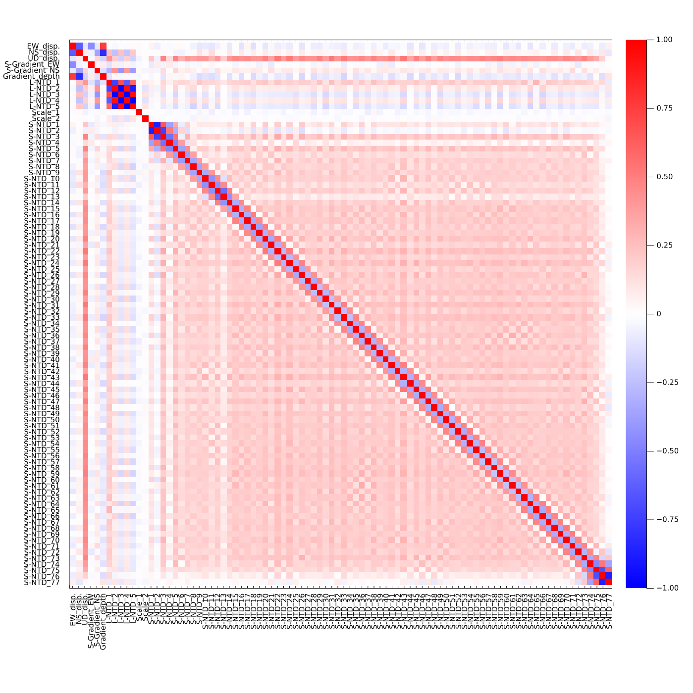
```

$ head -n 6 correlation.out | awk '{print \$1,\$2,\$3,\$4,\$5,\$6}'
```
Name: EW_disp. NS_disp. UD_disp. S-Gradient_EW S-Gradient_NS
"EW_disp." 1.0 -0.634376617642439 -0.09873898084769465 -0.4559821875070524 -0.08852812940100827
"NS_disp." -0.634376617642439 1.0 0.07959031864890413 -0.055760129578559775 -0.36041442138448465
"UD_disp." -0.09873898084769465 0.07959031864890413 1.0 -0.026356064178314775 0.1619929930250248
"S-Gradient_EW" -0.4559821875070524 -0.055760129578559775 -0.026356064178314775 1.0 -0.04550428034648942
"S-Gradient_NS" -0.08852812940100827 -0.36041442138448465 0.1619929930250248 -0.04550428034648942 1.0
```

You can see the strong correlation between the horizontal array displacements and the gradient depth, and between the vertical array displacement and NTDs.


### Histogram for each unknown parameter

From the MCMC samples ("sample.out"), you can draw a histogram for each unknown parameter by `plot_histogram(NPB,fn0,fn,fno,all,drawnls,nbins)`.
* NPB: Number of 3d B-spline bases
* fn0: Inversion results by `pos_array_all()` ("solve.out" in default), which is used when you'd like to plot the `pos_array_all()` results on the histogram
* fn: Input file ("sample.out" in default)
* fno: Output figure name (note that this file must be a PDF file: "histogram.pdf" in default)
* all: if `all=true`, histograms for all parameters are drawn; if `all=false`, histograms for major six parameters (array displacements, shallow gradients, gradient depth) (`all=false` in default)
* drawnls: if `drawnls=true`, a normal distribution estimated by `pos_array_all()` is drawn in a histogram (`drawnls=false` in default); the normal distributions are shown for the array displacements and 3d B-spline NTDs
* nbins: Number of histogram's intervals (`nbins=50` in default)

```julia
SeaGap.plot_histogram(77,all=true,fno="histogram_all.pdf")
```

```@raw html
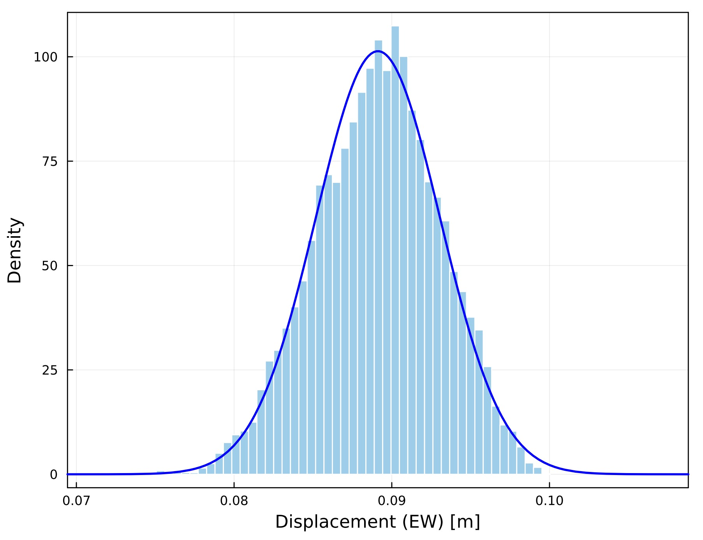
```

```julia
SeaGap.plot_histogram(77,all=true,fno="histogram_allv.pdf",drawnls=true)
```

```@raw html
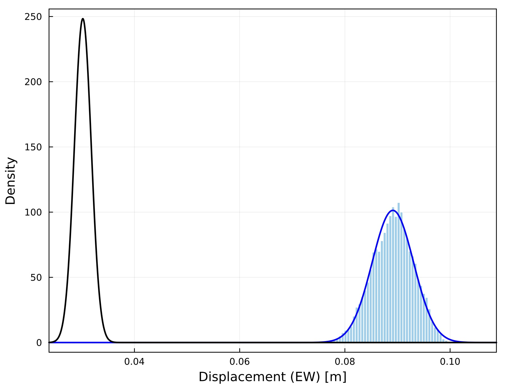
```

### Histograms and heatmaps for multiple parameters 

Using `plot_histogram2d(fn,fno,show,nshufflei,nbins)`, you can draw a figure showing hisograms, heatmaps, and scatter maps for major six parameters (array displacements, shallow gradients, gradient depth).
* fn: Input file ("sample.out" in default)
* fno: Output figure name
* show: if `show=true`, a figure is shown on REPL and is not saved as a file (`show=false` in default)
* nshuffle: number of plots for each parameter (if all samples are plotted, the figure is crowded; thus, `nshuffle` of samples are randomly picked; if `nshuffle=0`, all samples are plotted; `nshuffle=10000` in default)
* nbins: Number of histogram's intervals (`nbins=50` in default)
You can adjust fontsizes, margins of panels, and figure size by the other arguments. 

```julia
SeaGap.plot_histogram2d(fno="histogram2d.pdf")
```

```@raw html
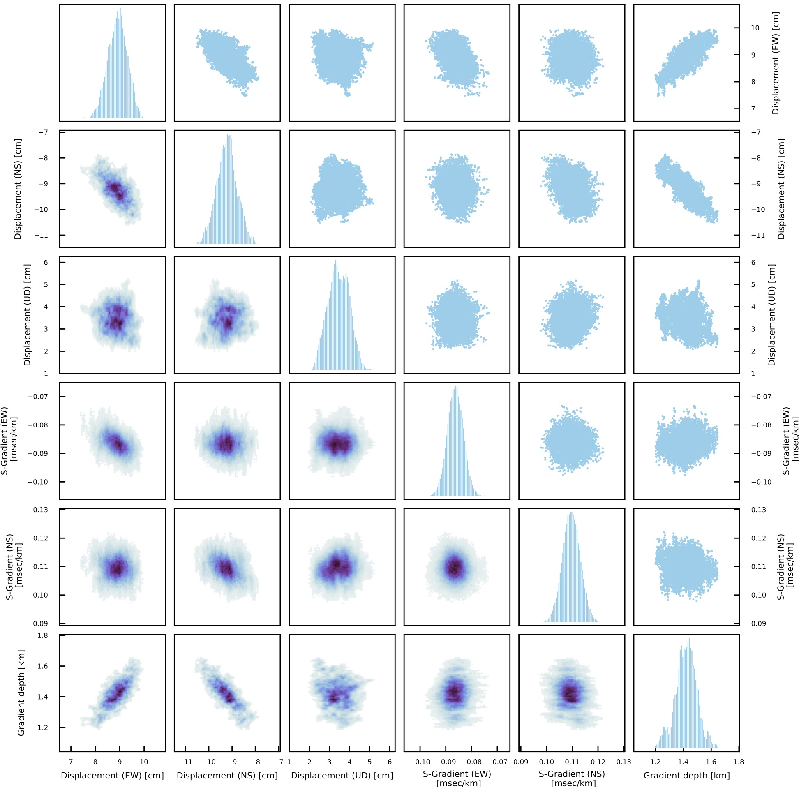
```

Diagonal panels show histograms for individual parameter.
Upper triangle panels show scatter maps for corresponding two parameters.
Lower triangle panels show heat maps for corresponding two parameters.

If you'd like to draw a heatmap for certain two parameters, you can make it by `plot_histogram2d_each(param1,param2,fn,fno,show,nbins)`.
`param1` and `param2` are the parameter names written in "initial.inp".

```julia
SeaGap.plot_histogram2d_each("UD_disp.","S-NTD_10",fno="histogram2d_UD_SNTD-10.png")
```

```@raw html
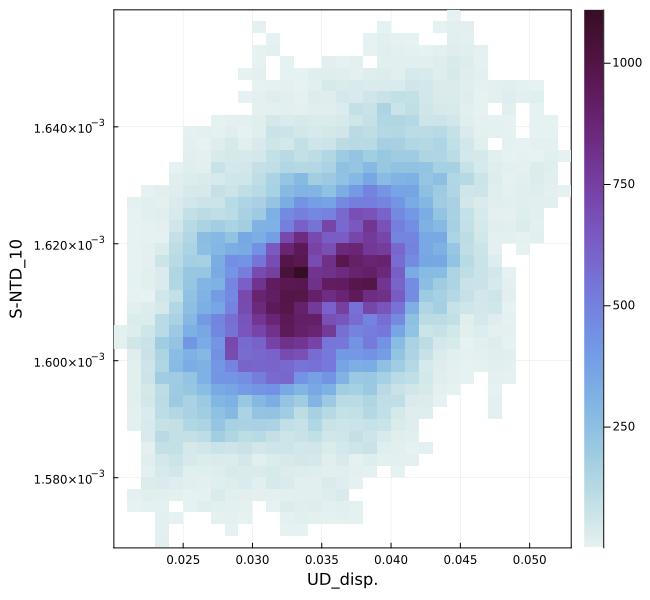
```

### Spatial variation of travel-time residuals (shallow gardient)

Considering from the observation equation (2), the projected travel-time residuals subtaracting the deep gradient and long-term NTD (``\frac{1}{M\left(\xi_{n,k}\right)} T_{n,k}^{\mathrm{obs}}-\frac{1}{M\left(\xi_{n,k}\right)} {T}^{\mathrm{cal}}\left(\mathbf{p}_k+\delta \mathbf{p}, \mathbf{u}\left(t_{n},{\bf b}_0\right), v_0\right)- \sum_{m=0}^{4} \gamma_{m}t^m_n-\frac{D}{2}\mathbf{g}_{\mathrm{s}}\mathbf{h}_{n,k}``) indicate the spatial variation due to the shallow gradients.
`plot_gradmap(xrange,yrange;autoscale,fn1,fn2,fno,show)` draws a sea-surface platform track with color of the spatial variation due to the shallow gradients.
* xrange: Range of EW component in meters when `autoscale=false`
* yrange: Range of NS component in meters when `autoscale=false`
* autoscale: If `autoscale=true`, the plot range is automatically defined
* fn1: File name of the seafloor transponder positions ("pxp-ini.xyh")  
* fn2: Travel-time residual file name ("residual\_grad.out")
* fno: Output figure name ("gradmap.pdf" in default)
* show: if `show=true`, a figure is shown on REPL and is not saved as a file (`show=false` in default)

```julia
SeaGap.plot_gradmap((-2500,2500),(-2500,2500),autoscale=false,fno="gradmap.png")
```

```@raw html
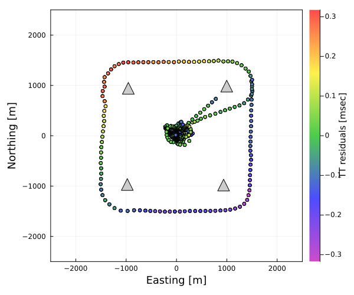
```


### Temporal variation of the travel-time residuals

Time-series of the travel-time residuals are plotted by `plot_ntdgrad(ntdrange,resrange;autoscale,fn,fno,show)`.
* ntdrange: Range of the upper two panels in msec when `autoscale=false`
* resrange: Range of the lowest panels in msec when `autoscale=false`
* autoscale: If `autoscale=true`, the plot range is automatically defined
* fn: Travel-time residual file name ("residual\_grad.out")
* fno: Output figure name ("ntdgrad.pdf" in default)
* show: if `show=true`, a figure is shown on REPL and is not saved as a file (`show=false` in default)

```julia
SeaGap.plot_ntdgrad()
```

```@raw html
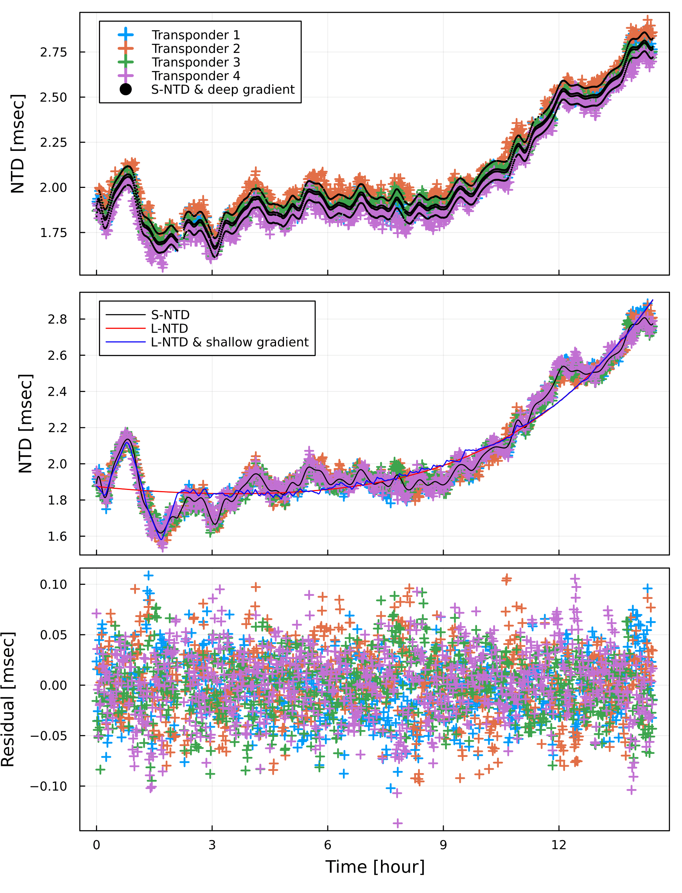
```

The upper panel shows the projected travel-time residuals (``\frac{1}{M\left(\xi_{n,k}\right)} T_{n,k}^{\mathrm{obs}}-\frac{1}{M\left(\xi_{n,k}\right)} {T}^{\mathrm{cal}}\left(\mathbf{p}_k+\delta \mathbf{p}, \mathbf{u}\left(t_{n},{\bf b}_0\right), v_0\right)``) by cross symbols.
Moreover, black dots show combination of the 3d B-splined NTD and the deep gradient contribution (``\sum_{j=1}^{J}c_j\Phi_j(t_n)+\frac{D}{2}\mathbf{g}_{\mathrm{s}}\mathbf{h}_{n,k}``)

The middle panel shows the projected travel-time residuals subtracting the deep gradient contribution (``\frac{1}{M\left(\xi_{n,k}\right)} T_{n,k}^{\mathrm{obs}}-\frac{1}{M\left(\xi_{n,k}\right)} {T}^{\mathrm{cal}}\left(\mathbf{p}_k+\delta \mathbf{p}, \mathbf{u}\left(t_{n},{\bf b}_0\right), v_0\right) - \frac{D}{2}\mathbf{g}_{\mathrm{s}}\mathbf{h}_{n,k}``) by the cross symbols.
Moreover, the 3d B-splined NTD, the long-term NTD, and combination of the long-term NTD and the shallow gradients are shown by black, red, and blue curves, respecively.

The lower panel shows the travel-time residuals in the observation equation 1.

## Run MCMC processing with additional constraints

As a developing function, you can perform the MCMC processing with additional constraints.
If you have acoustic data obtained from only a fixed-point survey, it is difficult to obtain stable positioning results by `pos_array_mcmcpvg()` as indicated by [Tomita & Kido (2022)](https://earth-planets-space.springeropen.com/articles/10.1186/s40623-022-01740-0).
Here, `pos_array_mcmcpvgc(lat,XDUCER_DEPTH,NPB,ss,gd0,sdg)` provides two additional constraints as prior distributions.

One prior distribution is a Cauchy distribution for shallow gradients with the location parameter of zero and the scale parameter of `ss`.
Shallow gradients can be determined by acoustic data obtained by spatially distributed sea-surface platform.
Thus, it is plausible to constrain the shallow gradients to be zero for stability when you do not have sufficient spatial distribution of a sea-surface platform.
Thus, `pos_array_mcmcpvgc()` provides the Cauchy distribution: if data is insufficient, the shallow gradients are constrained to be zero; if data is sufficient, the shallow gradients are followed with the data apart from zero because a Cauchy distribution allows outliers.
`ss` is set to be 3.e-4 as the default value, considering the results of [Tomita & Kido (2022)](https://earth-planets-space.springeropen.com/articles/10.1186/s40623-022-01740-0).

The other prior distribution is a Normal distribution for the gradient depth with the mean of `gd0` and the standard deviation of `sdg`.
If the data quantity is insuffient or the data include outliers, the gradient depth tends to have quite small or large value.
To avoid this, the prior distribution can constrain the gradient depth.
Refering the results of [Tomita & Kido (2022)](https://earth-planets-space.springeropen.com/articles/10.1186/s40623-022-01740-0), `gd0=0.65` [km] and `sgd=0.1` [km] are defined as the default values.

The parameters for the prior distributions can be optionally changed as following:
```julia
ss=5,e-4; gd0=0.5; sdg=0.2
SeaGap.pos_array_mcmcpvgc(lat,XDUCER_DEPTH,NPB,ss,gd0,sdg)
```

Formats of the input and output files of `pos_array_mcmcpvgc()` are same with those of `pos_array_mcmcpvg()`.

