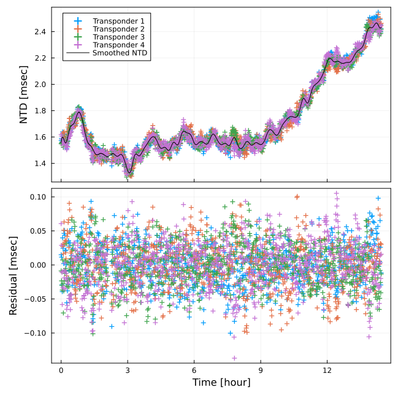

```@meta
CurrentModule = SeaGap
```

# Individual transponder positioning

In SeaGap, the individual transponder positioning function (`pos_single`) is provided.
A static array position and coefficients for the 3d B-spline functions can be estimated by Gauss-Newton method.
 
To perform `pos_single`, you have to prepare four input files denoted in "Dataformat": "tr-ant.inp". "pxp-ini.xyh", "ss\_prof.zv", and "obsdata.inp". Outliers in "obsdata.inp" should be removed in advance; SeaGap includes a simple [outlier removal](denoise.md) function. 

`pos_single(lat,XDUCER_DEPTH,NPB;fn1,fn2,fn3,fn4,fno1,fno2,fno3,fno4,delta_pos,ITMAX,eps)` can be performed as following:

```julia
lat=36.15753; XDUCER_DEPTH=5.0; NPB=77
SeaGap.pos_single(lat,XDUCER_DEPTH,NPB)
``` 

To perform `pos_single()`, you have to provide the site latitude and the rough depth of transducer from the sea-surface at the first and second arguments, respectively, as indicated in the previous pages ([Forward calculation](forward.md) and [Kinematic array positioning](tkinematic.md)).
Moreover, you also have to provide number of the 3d B-spline bases at the third argument.
Here, we provided the optimized value by `pos_array_all_AICBIC()` shown in [Static array positionining](tstatic.md).

The input files are `fn1`, `fn2`, `fn3`, and `fn4`; they correspond to "tr-ant.inp". "pxp-ini.xyh", "ss\_prof.zv", and "obsdata.inp" in default.
If you use the default file names, you need not to denote as arguments.

Then, after performing, you obtained a log file as `fno0` (`fno0="log.txt"` in default), a solution file `fno1` (`fno1="solve.out"`), a position file `fno2` (`fno2="position.out"`), a NTD file `fno3` (`fno3="ntd.out"`), and a B-spline function file `fno4` (`fno4="bspline.out"`).

`fno1` shows the estimated values for the all unknown paramters (Column 1) and their estimated errors (Column 2).
First ``3\times K`` paramters (``K`` is the total number of transponders) are the modification values for the individual transponder positions in meter (Line 1: EW for 1st transponder, 2: NS for 1st transponder, 3: UD for 1st transponder, 4: EW for 2nd transponder, ...), and the followings are the coeffiecnts for the 3d B-spline bases.

**$ head solve.out**
```
  0.2658388428491804     0.024569015907784604
  0.025742795674537085   0.02399259635741137
 -0.19755715591910972    0.028442417408041036
 -0.03800643698467722    0.02286029849133105
  0.022686934327046014   0.023626857627672134
 -0.2608886599629446     0.029442929092653593
 -0.03807199308216301    0.02336220247415864
 -0.28927604015700653    0.02413527551888121
 -0.1765728859793048     0.029529054142104653
  0.21993473831972557    0.023844891842485002
```

`fno2` shows the estimated individual transponder positions.
The line number of this file corresponds to the seafloor transponder number.
Each line shows each transponder position and its error (1-3: Position in EW, NS, UD [m], 4-6: Error in EW, NS, UD [m]). 

**$ cat position.out**
```
997.7747911228454 985.5901198171305 -2739.153406266786 0.02472460863058914 0.02444214165800418 0.028203784193629056
-956.9006540352337 941.9169305105304 -2683.504329735052 0.022925515455522613 0.023906230338089588 0.029733386921037858
-977.3090484561268 -968.9193202289746 -2689.4344319284196 0.023702323022765273 0.02396313104316993 0.029849896039000845
936.0724615282468 -980.8719171888088 -2710.938502539617 0.02388039378265668 0.02359798954529401 0.029008711726112996
```

`fno3` shows the modeled results for NTD (1: the observational time (cumulative seconds from the reference time), 2: Site number, 3: Normalized travel-time residuals ``\frac{1}{M\left(\xi_{n,k}\right)}T^{\rm obs}_{n,k}-\frac{1}{M\left(\xi_{n,k}\right)}T^{\rm cal}\left({\bf u}(t_n, {\bf b}_0),{\bf p}_k+\delta{\bf p},v_0\right)``, 4: Modeled NTD (``\sum_{j=1}^{J}c_j\Phi_j(t_n)``), 5: Residuals between the columns 4 and 5).

**$ head ntd.out**
```
 5.00664920015051e8    1.0  0.0015734757771305313  0.0015585524024106375   1.4923374719893806e-5
 5.0066492022755253e8  3.0  0.0015483864275041307  0.0015571534615690592  -8.767034064928415e-6
 5.0066492010527e8     4.0  0.0016185863755775565  0.0015578712720816016   6.071510349595489e-5
 5.0066498000643504e8  1.0  0.0015895858435735586  0.0015780548177290327   1.153102584452591e-5
 5.00664980241396e8    3.0  0.0015533669924474944  0.0015767690786148026  -2.3402086167308156e-5
 5.00664980102315e8    4.0  0.0016068241977754477  0.0015780175518637083   2.8806645911739386e-5
 5.00665039994504e8    1.0  0.0015621919371987954  0.0015913942840968594  -2.9202346898063967e-5
 5.006650402641685e8   3.0  0.001560291056204606   0.0015901992625636937  -2.9908206359087735e-5
 5.006650401017465e8   4.0  0.0015803984080293393  0.001591115282135646   -1.0716874106306675e-5
 5.0066509998064e8     1.0  0.0015585910901855092  0.001597789267778124   -3.919817759261471e-5
```

`fno4` shows the modeled results of B-spline function (1: number of the 3d B-spline bases, 2: usable ID (if the corresponding basis is not used in the modeling, ID = 0), 3: the observational time (cumulative seconds from the reference time), 4: the estimated coefficents of the 3d B-spline bases).

**$ head bspline.out**
```
  1.0   1.0  5.0066421474273527e8  0.0008876777417188695
  2.0   2.0  5.00664917e8          0.0017243261028300166
  3.0   3.0  5.0066561925726473e8  0.0014548506271236715
  4.0   4.0  5.006663215145295e8   0.0016991616248147239
  5.0   5.0  5.0066702377179426e8  0.0016604366381957648
  6.0   6.0  5.0066772602905905e8  0.001822054896785014
  7.0   7.0  5.006684282863238e8   0.0017164694504470956
  8.0   8.0  5.006691305435885e8   0.0015291235496676736
  9.0   9.0  5.006698328008533e8   0.0015292208523932749
 10.0  10.0  5.0067053505811805e8  0.0014303858302460995
```

You can change analysis conditions by the keyword arguments:
```julia
SeaGap.pos_single(lat,XDUCER_DEPTH,NPB,delta_pos=1.e-5)
```
* `eps`: Convergence criteria [m], the default is 1.e-4 (each inversion is converged when RMS of difference between the previous and the new solutions of the horizontal array displacements < `eps`)
* `ITMAX`: Maximum number of interations, the default is 50
* `delta_pos`: Infinitesimal amount of the array positions to calculate the Jacobian matrix, the default is 1.e-4 [m] 

The teime-series of NTD (temporal sound speed fluctuation) is summarized in `fno3="ntd.out"`, and it can be visualized by `plot_ntd(ntdrange,resrange; autoscale,fn,fno,show)` as well as [the static array positioning](tstatic.md) `pos_array_all`.

```julia
SeaGap.plot_ntd(fno="ntd_single.png")
```

```@raw html

```

To obtain precise individual transponder positions for "pxp-ini.xyh", it is a simple but powerful way that we first estimate positions of the individual seafloor transponders from single campaign data (shown in `fno2="position.out"`) and then average them from multiple campiagns as the initial positions.

