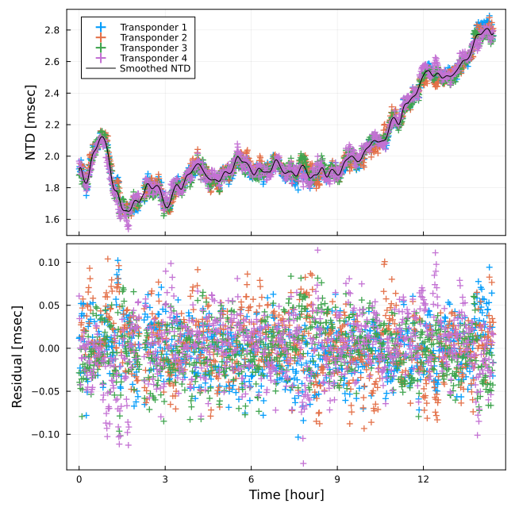
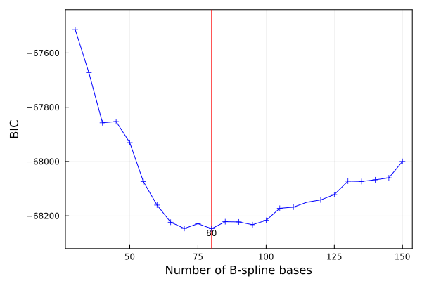
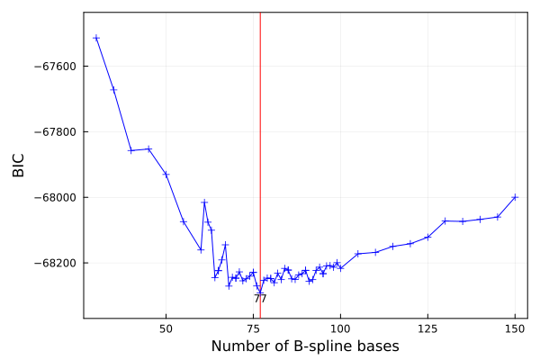

```@meta
CurrentModule = SeaGap
```


# Static array positioning

In SeaGap, the static positioning function (`pos_array_all`) based on [Tomita & Kido (2022)](https://earth-planets-space.springeropen.com/articles/10.1186/s40623-022-01740-0) is provided.
A static array position and coefficients for the 3d B-spline functions can be estimated by Gauss-Newton method.
Moreover, to optimize the number of the 3d B-spline bases, SeaGap has a function to calculate AIC and BIC values for various number of the 3d B-spline bases (`pos_array_all_AICBIC`).
As a derived function from `pos_array_all`, a function `pos_array_TR` additionally estimates an offset between a transducer and a GNSS antenna.
 
## Basic static array positioning

To perform `pos_array_all`, you have to prepare four input files denoted in "Dataformat": "tr-ant.inp". "pxp-ini.xyh", "ss\_prof.zv", and "obsdata.inp". Outliers in "obsdata.inp" should be removed in advance; SeaGap includes a simple [outlier removal](denoise.md) function. 

The basic static array positioning `pos_array_all()` can be performed as following:

```julia
lat=36.15753; XDUCER_DEPTH=5.0; NPB=100
SeaGap.pos_array_all(lat,XDUCER_DEPTH,NPB)
``` 

To perform `pos_array_all()`, you have to provide the site latitude and the rough depth of transducer from the sea-surface at the first and second arguments, respectively, as indicated in the previous pages ([Forward calculation](forward.md) and [Kinematic array positioning](tkinematic.md)).
Moreover, you also have to provide number of the 3d B-spline bases at the third argument.
Here, we provided 100 bases for instance.

The input files are `fn1`, `fn2`, `fn3`, and `fn4`; they correspond to "tr-ant.inp". "pxp-ini.xyh", "ss\_prof.zv", and "obsdata.inp" in default.
If you use the default file names, you need not to denote as arguments.

Then, after performing, you obtained a log file as `fno0` (`fno0="log.txt"` in default), a solution file `fno1` (`fno1="solve.out"`), a position file `fno2` (`fno2="position.out"`), a NTD file `fno3` (`fno3="residual.out"`), a B-spline function file `fno4` (`fno4="bspline.out"`), and a AIC/BIC file `fno5` (`fno5="AICBIC.out"`).

`fno1` shows the estimated values for the all unknown paramters (Column 1) and their estimated errors (Column 2).
First three paramters are the array displacement in meter (Line 1: EW, 2: NS, 3: UD), and the followings are the coeffiecnts for the 3d B-spline bases.

$ head solve.out
```
  0.03016870329108975    0.0015837742430485642
 -0.017291984493650502   0.0015789217333432297
  0.040657598385999076   0.005785765032466023
  0.0015211235935625976  0.00019127667561664918
  0.002019534277503533   3.5611045018091246e-5
  0.0018423938269547732  1.86381804747842e-5
  0.0017997817218493534  1.4677602480732858e-5
  0.002033034277571156   1.388740280606415e-5
  0.0020293506899085128  1.3761626259275398e-5
  0.002136698956976763   1.3715555729368263e-5
```

`fno2` shows general positioning results (1: Average observational time (cumulative seconds from the reference time), 2-4: the estimated array displacements in EW, NS, and UD, 5-7: 1``\sigma`` estimation errors in EW, NS, and UD).

$ cat position.out
```
5.00690900363141e8  0.03016870329108975  -0.017291984493650502  0.040657598385999076  0.0015837742430485642  0.0015789217333432297  0.005785765032466023
```

`fno3` shows the modeled results for NTD (1: the observational time (cumulative seconds from the reference time), 2: Site number, 3: Normalized travel-time residuals ``\frac{1}{M\left(\xi_{n,k}\right)}T^{\rm obs}_{n,k}-\frac{1}{M\left(\xi_{n,k}\right)}T^{\rm cal}\left({\bf u}(t_n, {\bf b}_0),{\bf p}_k+\delta{\bf p},v_0\right)``, 4: Modeled NTD (``\sum_{j=1}^{J}c_j\Phi_j(t_n)``), 5: Residuals between the columns 4 and 5).

$ head residual.out
```
 5.00664920015051e8    1.0  0.0019194751443163372  0.0019078805382536155   1.159460606272168e-5
 5.0066492022755253e8  3.0  0.0018793925787709523  0.001907899038987111   -2.8506460216158776e-5
 5.0066492010527e8     4.0  0.001968642829947369   0.001907866003982035    6.077682596533412e-5
 5.0066498000643504e8  1.0  0.0019341358646090842  0.0019214257952172098   1.2710069391874386e-5
 5.00664980241396e8    3.0  0.0018818573227057482  0.0019214202683859388  -3.9562945680190554e-5
 5.00664980102315e8    4.0  0.0019559217251406812  0.0019214007623962256   3.452096274445568e-5
 5.00665039994504e8    1.0  0.0019046964317517385  0.0019276958929134143  -2.2999461161675797e-5
 5.006650402641685e8   3.0  0.0018852779189122472  0.0019276653273191252  -4.2387408406878045e-5
 5.006650401017465e8   4.0  0.001928001663903776   0.001927660645156722    3.410187470540959e-7
 5.0066509998064e8     1.0  0.0018988272659300988  0.0019278273265752757  -2.9000060645176977e-5
```

`fno4` shows the modeled results of B-spline function (1: number of the 3d B-spline bases, 2: usable ID (if the corresponding basis is not used in the modeling, ID = 0), 3: the observational time (cumulative seconds from the reference time), 4: the estimated coefficents of the 3d B-spline bases).

$ head bspline.out 
```
   1.0    1.0  5.006643812573444e8   0.0015211235935625976
   2.0    2.0  5.00664917e8          0.002019534277503533
   3.0    3.0  5.006654527426556e8   0.0018423938269547732
   4.0    4.0  5.0066598848531115e8  0.0017997817218493534
   5.0    5.0  5.006665242279668e8   0.002033034277571156
   6.0    6.0  5.0066705997062236e8  0.0020293506899085128
   7.0    7.0  5.0066759571327794e8  0.002136698956976763
   8.0    8.0  5.006681314559335e8   0.002118630274338342
   9.0    9.0  5.006686671985891e8   0.0019997342050746816
  10.0   10.0  5.006692029412447e8   0.0017556395427348488
```

`fno5` shows AIC and BIC values (1: total number of  the 3d B-spline bases, 2: AIC, 3: BIC).

$ cat AICBIC.out
```
100 -68846.58463077551 -68216.74756443244
```

You can change analysis conditions by the keyword arguments:
```julia
SeaGap.pos_array_each(lat,XDUCER_DEPTH,NPB,delta_pos=1.e-5)
```
* `eps`: Convergence criteria [m], the default is 1.e-4 (each inversion is conve
rged when RMS of difference between the previous and the new solutions of the ho
rizontal array displacements < `eps`)
* `ITMAX`: Maximum number of interations, the default is 50
* `delta_pos`: Infinitesimal amount of the array positions to calculate the Jacobian matrix, the default is 1.e-4 [m] 

## Visualization of NTD and residuals

The teime-series of NTD (temporal sound speed fluctuation) is summarized in `fno3="residual.out"`, and it can be visualized by `plot_ntd(ntdrange,resrange; autoscale,fn,fno,show)`

* If `autoscale=true` (default), the plot range is automatically determined. If `autoscale=false`, the plot range of y-componet is fixed by `ntdrange` and `resrange`. The range of x-compoent (Time) is automatically determined in the both cases.
* `fn` is the input file name: "residual.out" in default.
* If `show=false`, the figure is saved as `fno` (`fno` is name of the output figure: "ntd.pdf" in default). If `show=true` in REPL, a figure is temporally shown.

```julia
SeaGap.plot_ntd(fno="ntd.pdf")
```

```@raw html

```

* Top panel
The colored plots show the normalized travel-time residuals ``\frac{1}{M\left(\xi_{n,k}\right)}T^{\rm obs}_{n,k}-\frac{1}{M\left(\xi_{n,k}\right)}T^{\rm cal}\left({\bf u}(t_n, {\bf b}_0),{\bf p}_k+\delta{\bf p},v_0\right)``.
Note that ``T^{\rm cal}`` is calculated from the optimized seafloor transponder positions.
The black curve shows the optimized NTD fluctuation modeled by the 3d B-spline functions.

* Bottom panel
The final travel-time residuals for each seafloor transponder are shown, which correspond to the colored plots subtracting the black curve in the top panel.

## Optimization of the total number of 3d B-spline bases

In SeaGap, the bases of the 3d B-spline function are deployed with temporally constant intervals, and the number of them can be optionally provided. 
The number of the bases of the 3d B-spline function directly affects temporal smoothness of the modeled NTD fluctuation so that it should be optimized depending on the observational data.

`pos_array_all_AICBIC(r1,r2,r3,lat,XDUCER_DEPTH; fno,delete)` is a function to calculate AIC and BIC for various number of 3d B-spline bases.
 `r1`, `r2`, and `r3` are all integers expressing the search range: minimum, maximum, and interval number, respectively.

For example,
```julia
SeaGap.pos_array_all_AICBIC(30,150,5,lat,XDUCER_DEPTH)
```

As a result, you obtain `fno` (the output file: "AICBIC\_search.out" in default) showing (1: Total number of 3d B-spline bases, 2: AIC, 3: BIC, 4: RMS [sec]).

$ head AICBIC\_search.out
```
30 -67715.5649433315 -67513.77248518275 3.9674441413194116e-5
35 -67904.76265703465 -67672.39558401487 3.851018840214079e-5
40 -68120.29855213231 -67857.35686424152 3.723318255152355e-5
45 -68146.26476568381 -67852.74846292198 3.7033490223809215e-5
50 -68254.47102905806 -67930.38011142521 3.63846965922283e-5
55 -68428.9047453055 -68074.23921280164 3.5395031292152615e-5
60 -68545.8026433101 -68160.56249593521 3.4729778303512695e-5
65 -68639.48522726737 -68223.67046502147 3.4195522163512604e-5
70 -68692.94624232204 -68246.5568652051 3.3872582673738174e-5
75 -68706.10175307392 -68229.13776108596 3.3755510195622056e-5
```

You can check the results by `plot_AICBIC(;type,fn,fno,show)`.
You set `type` as "AIC" or "BIC".
`fn` is the input file (""AICBIC\_search.out" in default") for plot.
If `show=false`, the plot is saved as `fno` (`fno` is the figure name; "AICBIC\_search.pdf" in default).
If `show=true`, the plot is temporally shown on REPL.

```julia
SeaGap.plot_AICBIC(type="BIC",show=true)
```

```@raw html

```

The number of 3d B-spline bases with the minimum criterion is shown by a red vertical line. 

If you'd like to check in detail, you can additionally perform `pos_array_all_AICBIC()`:
```julia
SeaGap.pos_array_all_AICBIC(61,99,1,lat,XDUCER_DEPTH)
```

The AIC and BIC values are additionally written in `fno` (the output file: "AICBIC\_search.out" in default).
If you'd like to save the results in a new file, you add `delete=true`.

```julia
SeaGap.plot_AICBIC(type="BIC",fno="BIC_search.png")
```

```@raw html

```

## Optimization of the transducer-antenna offset


`pos_array_TR()` performs the static array positioning with optimization of an offset between a transducer and a GNSS antenna.
The initial values of the offset are shown in `fn1="tr-ant.inp"`.

```julia
lat=36.15753; XDUCER_DEPTH=5.0; NPB=77
SeaGap.pos_array_TR(lat,XDUCER_DEPTH,NPB)
```

The arguments and the input/output files of `pos_array_TR()` are same with those of `pos_array_all()` except `fno1`, `fno5`, and `delta_offset`.
`fno1` shows the estimated values for the all unknown paramters (Column 1) and their estimated errors (Column 2) as same with `pos_array_all()`, and its file name is "solve.out" in default.
However, the lines 4-6 in `fno1` shows the solutions and the errors for the modification values of the offset from the initial file (`fn1="tr-ant.inp"`).

`fno5` in `pos_array_TR()` shows three components of the estimated offset values and their estimation errors (1-3: Offset in X, Y, Z, 4-6: Error in X, Y, Z).
The default name of `fno5` is "tr-ant.out"

$ cat tr-ant.out  
```
# TR_offset: dx, dy, dz, sigmax, sigmay, sigmaz
0.36263055102029373 17.72528757116563 -11.417248564560044 0.0021584714990507776 0.0020794994652210477 0.021231771169224003
```

Note that the estimated offset (especially in Z component) and the error are strongly influenced by `delta_offset` which is a infinitesimal value to calculate the Jacobian matrix.

You can make a figure on NTD fluctuation using `plot_ntd()`.


## Static array positioning directly estimating deep gradients

`pos_array_pvg()` is a function to estimate the array position, NTD, and the deep gradient following the observation equation (0) shown in Methodolgy.

```julia
lat=36.15753; XDUCER_DEPTH=5.0; NPB=77
SeaGap.pos_array_pvg(lat,XDUCER_DEPTH,NPB)
```

The input and output files are same with `pos_array_all()` except `fno1` (solve.out).
`fno1` shows the estimated values for the all unknown paramters (Column 1) and their estimated errors (Column 2).
First three paramters are the array displacement in meter (Line 1: EW, 2: NS, 3: UD), following two parameters are the deep gradients (EW and NS components), and the followings are the coeffiecnts for the 3d B-spline bases.

**$ head solve.out**
```
  0.06186500501267254    0.00992683409066011
 -0.10741363544193698    0.00997340191013794
  0.04151063120851943    0.0057541462062501965
 -0.00176174309735594    1.018494235927363e-5
  0.004735467821527803   1.024917937077662e-5
  0.0015035283932803714  0.00018873162119166135
  0.002027055280703528   3.5164026406347694e-5
  0.001840663027096163   1.8448401165606075e-5
  0.0018087390392073942  1.4870952333418019e-5
  0.002046647728789619   1.3874065160409779e-5
```

